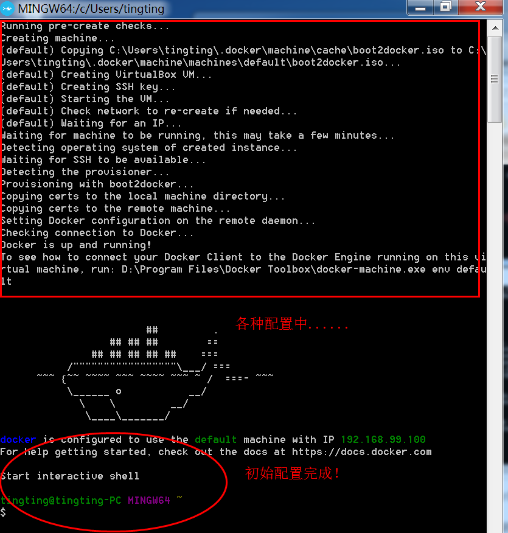
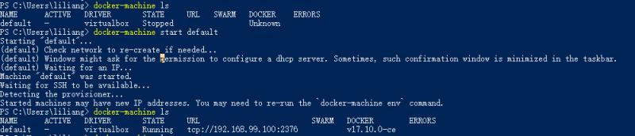
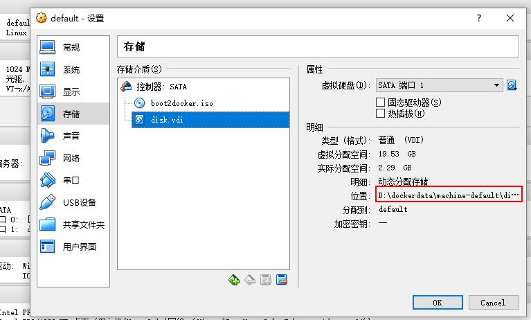
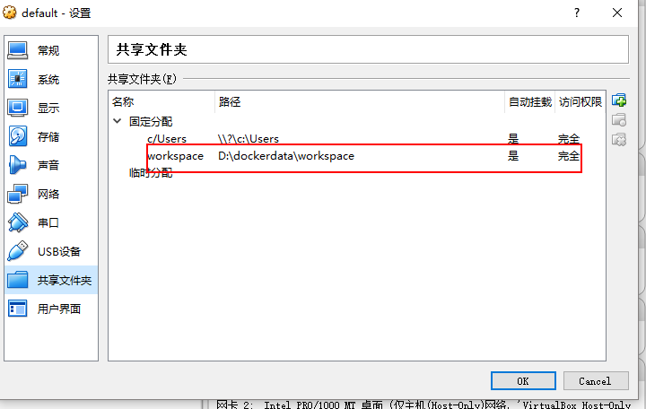
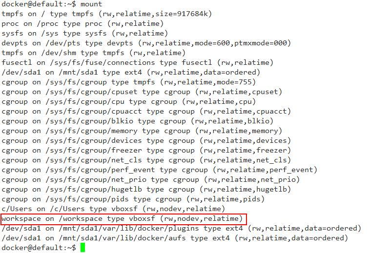
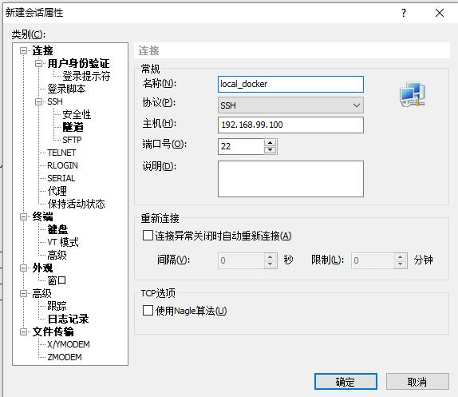
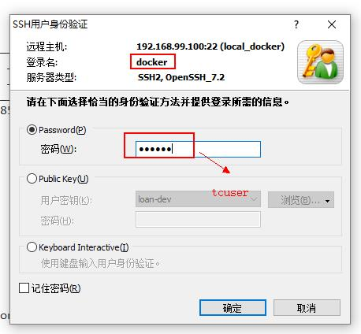
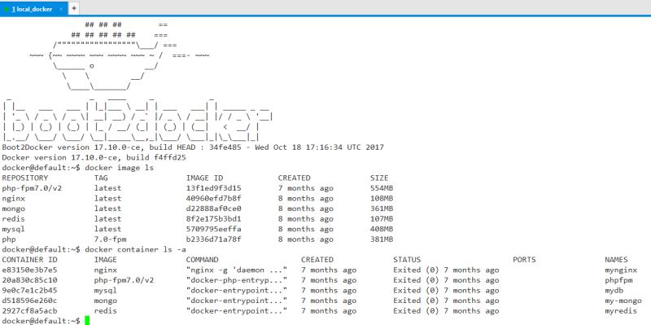
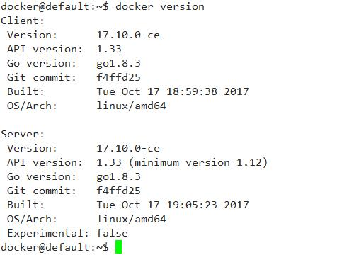

# Window 10 下使用 Docker

> 参考出处：https://www.cnblogs.com/studyzy/p/6113221.html <br/>
> 参考出处: https://blog.csdn.net/tina_ttl/article/details/51372604

## 安装

直接去官网下载 window 版本的安装包，然后点击下一步什么的，就完成安装了。

安装要求：

- 64 位操作系统，win7 或者更高
- 支持 Hardware Virtualization Technology, 并且 virtualization 可用

## 基本使用

在 Window 下安装 Docker，其实是在 Window 下安装一个 VirtualBox 用于管理 Docker 虚拟机。在安装完成后，会有个 Docker Quickstart Terminal 的图标，打开这个 Termainal 后，会自动进行一些设置，然后启动 Docker，在可以在该终端使用 docker 命令了。



但是，我经常使用这个 Docker Quickstart Terminal 经常报错。运行后会在 Virtaulbox 中创建一个叫做 default 的虚拟机，然后很有可能会卡在 waiting for an IP 的命令下，然后就死活不动了。感觉这个东西有问题，不喜欢使用，并且这个终端不能复制什么的，难用。我们可以用 PowerShell 进行虚拟机的管理。

> 使用 Qocker Quickstart Terminal 可能遇到的卡主的问题，有可能是因为电脑没有开启支持 VT-X/AMD-v 功能，即没有开启虚拟化技术，需要重启电脑，去 BIOS 里开启该功能。

打开 PowerShell，输入：

```shell
docker-machine ls
```

可以看到我们当前的 Docker 虚拟机的状态。如果什么都没有，那么我们可以使用命令创建一个 Docker 虚拟机。

```shell
docker-machine create --driver=virtualbox default
```

创建完毕后，可以使用 `docker-machine ls` 确认我们的 Docker 虚拟机在运行中。

然后使用一下命令获取虚拟机的环境变量：

```shell
docker-machine env default
```

然后在输入：

```shell
docker-machine env default |Invoke-Expression
```

这样我们就把当前的 PowerShell 和虚拟机里的 Docker Linux 建立的连接，接下来就可以在 PowerShell 中使用 `docker` 命令了。

比如查看镜像：`docker image ls`

当前有那些容器： `docker ps -a` 或者 `docker container ls -a`

停止机器可以使用 `docker-machine stop default` 来停止。



## Docker 虚拟机文件地址修改

默认情况下，docker-machine 创建的虚拟机文件，是保存在 C 盘的 `C:\Users\用户名\.docker\machine\machines\default` 目录下的，如果下载和使用的镜像过多，那么必然导致该文件夹过大，如果 C 盘比较吃紧，那么我们就得考虑把该虚拟机移动到另一个盘上。具体操作如下：

1.  使用 `docker-machine stop default` 停掉 Docker 的虚拟机。
2.  打开 `VirtualBox`，选择 `管理` 菜单下的 `虚拟介质管理`，我们可以看到 Docker 虚拟机用的虚拟硬盘的文件 `disk`。
3.  选中 `disk`，然后点击菜单中的 `复制` 命令，根据向导，把当前的 `disk` 复制到另一个盘上面去。
4.  回到 VirtualBox 主界面，右键 `default` 这个虚拟机，选择 `设置` 命令，在弹出的窗口中选择 `存储` 选项。
5.  把 disk 从 `控制器SATA` 中删除，然后重新添加我们刚才复制到另外一个磁盘上的那个文件。
6.  `确定`， 然后回到 PowerShell, 使用 `docker-machine start default` 就可以启动新地址的 Docker 虚拟机了。确保新磁盘的虚拟机没有问题，就可以把 C 盘的那个 disk 文件删除了。

下面是我这边设置号的界面情况



> 注意：不要在 Window 中直接去复制粘贴 disk 文件，这样会在步骤 5 的时候报错的，报错，所以一定要在 VirtualBox 中去复制！

## VirtualBox 共享目录到 Docker 虚拟机中

在 VirtualBox 中 `设置` -> `共享文件夹` -> `新建`图标点击后，弹出的对话框中输入对应的共享目录和共享文件夹名称， 选择号权限。



然后登录 default 使用以下命令可以把共享文件夹挂载到对应的 Docker 虚拟机目录下：

```shell
sudo -s
mount -t vboxsf workspace /workspace
mount # 查看挂载情况
```



## 使用远程连接工具连接 Docker

安装上面方法使用的管理工具不喜欢，可以使用 XShell 远程连接工具进行管理，操作也方便。

- 运行 XShell



- 连接 docker



> **注：默认的用户名和密码是：docker/tcuser**

- 使用 XShell 登录与 Docker Quickstart Terminal 或者 PowerShell 是一样的显示启动效果的。



> 注意：使用 XShell 连接 Docker 虚拟机，需要确保 Docker 虚拟机已经启动好。即 `docker-machine start default` 启动后，`docker-machine ls` 可以查看到当前 default 机器已经启动，STATE: Running 和 可以看到该机器的 IP(不是本地 127.0.0.1)。

## Docker 更新

如果本机安装的 docker 过期了，也就是有新版本的 docker 发布时，可以对本机的 docker 进行更新，

可以直接在 PowerShell 终端中，直接使用如下命令：

```shell
docker-machine upgrade default
```

输入命令后回车，会自动更新本机的 docker。

查看 docker 版本：`docker version`


