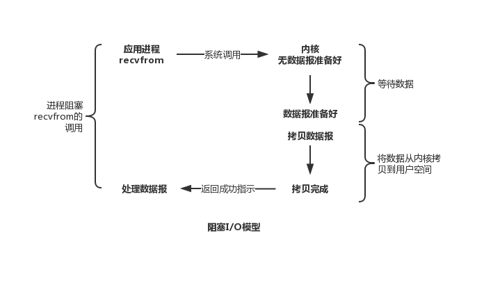
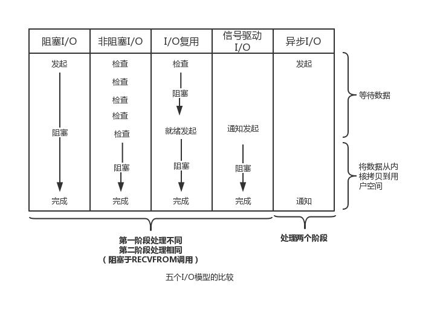
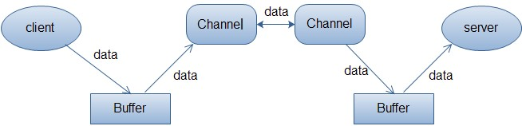

# Linux 五种 IO 模型

> 出处：https://github.com/ZhongyangMA/webflux-streaming-demo/wiki/%E5%8F%8D%E5%BA%94%E5%BC%8F%E7%BC%96%E7%A8%8B%E6%A6%82%E8%A7%88%EF%BC%88%E4%B8%AD%E6%96%87%E7%89%88%EF%BC%89 作 者： 马仲阳

1. 阻塞IO（Blocking IO）
2. 非阻塞IO（Non-blocking IO）
3. 多路复用 IO（IO multiplexing）
4. 信号驱动 IO (signal driven IO (SIGIO))
5. 异步IO（asynchronous I/O）

前四种都是同步的，只有最后一种才是异步IO。

## 阻塞 IO(Blocking IO)



IO过程分为：(1)内核数据准备 (2)数据从内核空间拷贝到用户空间 这两个阶段。在用户线程发起IO调用后，用户线程在这两个阶段全程等待，直到有结果返回。这种IO就是阻塞IO模型。

## 非阻塞IO(Non-Blocking IO)


非阻塞IO模型下，在用户线程发起IO调用后，在内核数据还未准备好时，IO函数可立即返回。用户线程通过多次调用IO函数来检查内黑数据是否准备好（轮询），当检查到数据准备好后，执行第二阶段，将数据从内核空间拷贝到用户空间，这一阶段用户线程是阻塞到。

## 多路服用IO（IO multiplexing）


用户线程通过select、poll、epoll等函数阻塞式地监听多路IO事件，直到有一个或多个IO操作处于就绪状态（有数据可读或者可写）时返回，开始进行IO操作。多路复用模型读特点是可以通过一个线程处理多路IO请求。

## 信号驱动IO（signal driven I/O (SIGIO)）


用户线程发器IO操作后，可立即返回不阻塞。等待内核数据准备完成后，通过信号函数通知用户线程，执行第二阶段数据拷贝操作。

## 异步IO（asynchronous I/O）


异步IO的特点是用户线程发起IO请求后立即返回，在IO操作的两个阶段全程都不阻塞，不需要用户线程参与，直到最后数据拷贝完成后，内核发送信号通知用户线程处理完毕。

## 五种IO模型的比较




# Java中的四种IO模型

Unix 中的五种IO模型，除信号驱动模型外，java对其他四种IO模型都有支持
1. 其中java最早提供的blocking IO即是阻塞IO
2. 而NIO即是非阻塞IO
3. 同时NIO中的Reactor模式即是IO多路复用模型的实现
4. 通过AIO实现的Proactor模式即是异步IO模型的实现

java 中传统的IO都是阻塞IO，比如通过socket来读取数据，调用read 方法之后，如果数据没有就绪，当前线程就会一直阻塞在read方法调用那里，直到有数据才返回。因此在传统的网络服务设计状态，这时如果又来一个client的请求，只好再启动一个新的线程去服务它，一个线程的阻塞不会影响其他线程工作。这种服务方式虽然看起来简便，但服务器为每个client都启动一个线程，资源消耗非常大。线程池的方式使得线程可以重复使用，在一定程度上减少来创建和销毁线程的系统开销。

多线程（或线程池）模式适用于大部分的连接为短连接的情景。如果大部分连接都为长连接，而同一时刻只有少数连接中存在IO操作，那么为每一个连接安排一个线程的服务方式是非常浪费的。因此便出现来如下的高性能IO模型--采用Reactor模式的Java NIO 模型，这也是Reactive Programming中最为重要的概念。

# Java NIO 模型

先来了解一下Java NIO中的几个重要概念：Channel（通道），Buffer（缓冲区），Selector（选择器）。

## Channel（通道）

Channel 和传统IO中的stream流很相似，只不过Stream是单向的，要么是InputStream只能进行读，要么是OutputStream只能进行写，而Channel是双向的。

以下是常用的几种通道：

+ FileChannel - 可以向文件读写数据
+ SocketChannel - 以TCP来向网络连接的两端读写数据
+ ServerSocketChannel - 能够监听客户端发起的TCP连接，并为每个TCP连接创建一个新的SocketChannel
+ DdatagramChannel - 以UDP协议来向网络连接的两端读写数据

## Buffer（缓冲区）

Buffer， 顾名思义，缓冲区，实际上是一个容器，是一个连续的数组。Channel 提供从文件、网络读取数据的渠道，但是读取或者写入的数据都必须经由 Buffer。



上图描述流客户端向服务端发送数据，然后服务端接收数据的全部过程。客户端发送数据时，必须先将数据存入Buffer中，然后将Buffer中的内容写入通道。服务端这边接收数据必须通过Channel将数据读入到Buffer中，然后再从Buffer中读取出数据来处理。

## Selector（选择器）

Selector类是NIO的核心类，Selector能够检测多个注册的通道Channel上是否有事件发生，如果有，便获取事件然后针对每个事件进行相应的处理。这样一来，只用一个单线程就可以管理多个通道，也就是管理多个连接。这样使得只有在连接真正有读写事件发生时，才会调用函数来进行读写。这种方式不必为每个连接创建一个线程，不用去维护多个线程，减少系统的开销。

与Selector有关的一个关键类是SelectionKey，一个SelectionKey代表一个到达的事件，这两个类构成类服务端处理业务的关键逻辑。

下图表示单线程运行的Selector同时管理多个通道（连接）。


Selector 的创建和可以监听的事件如下：

```code
Selector selector = Selector.open();  // 创建 Selector
SelectionKey key = channel.register(selector, Selectionkey.OP_READ);   // 将通道注册到 Selector 上
register 的第二个参数指明监听哪些事件，可选的值有：
Connect - 连接就绪
Accept - 接收就绪
Read - 读就绪
Write - 写就绪
与之对应的检测 Channel 中什么事件或操作已经就绪的函数为：
selectionKey.isConnectable();  // 是否连接就绪
selectionKey.isAcceptable();    // 是否接收就绪
selectionKey.isReadable();      // 是否读就绪
selectionKey.isWritable();        // 是否写就绪
```

## Java NIO 代码示例

```java 
// 创建 Selector
Selector selector = Selector.open();
// 创建 ServerSocketChannel 并绑定到指定端口
ServerSocketChannel server = ServerSocketChannel.open();
server.bind(new InetSocketAddress("127.0.0.1", 1234));
// 设置 ServerSocketChannel 为 non-blocking
server.configureBlocking(false);
// 将 server channel 注册到 selector 并设置监听 OP_ACCEPT 事件
server.register(selector, SelectionKey.OP_ACCEPT);
while (true) {
    // selector 被 select() 阻塞
    // select() 会把注册的事件添加到 SelectionKeys (只增不减)
    if (selector.select() == 0) {
        continue;
    }
    // 获得 SelectionKey 集合, 每一个 Selectionkey 对应着一个已注册的 Channel
    Set<SelectionKey> keys = selector.selectedKeys();
    for (SelectionKey key : keys) {
        if (key.isAcceptable()) {
	    // 获取与 client 相连的 SocketChannel
	    SocketChannel channel = ((ServerSocketChannel) key.channel()).accept();
	    // 同样设置为 non-blocking
	    channel.configureBlocking(false);
            // 这里可以向 client 发送信息
            channel.write(ByteBuffer.wrap(new String("向客户端发送了一条信息!").getBytes()));  
            // 将此 channel 的 OP_READ 事件注册到 selector
            channel.register(this.selector, SelectionKey.OP_READ);  
	}
	// 如果 channel 可读
	if (key.isReadable()) {
	    SocketChannel channel = (SocketChannel) key.channel();
	    // 创建读缓冲区
            ByteBuffer buffer = ByteBuffer.allocate(10);  
            channel.read(buffer);
	}
	// 由于 select() 对 SelectionKey 集合只增不减 这里需手动移除 key
	keys.remove(key);
    }
}

```

# Reactor 模式

 Reactor 模式分为三种类型，分别是：Basic version, Multi-threaded version 和 Multi-reactors version.

## Basic version (Single threaded)


如图所示为 Reactor 模式的单线程版本，所有的 I/O 操作都在同一个 NIO 线程上面完成。NIO 线程即是 Reactor、Acceptor 负责监听多路 socket 并Accept 新连接，又负责分派、处理请求。对于一些小容量应用场景，可以使用单线程模型，但是对于高负载、大并发的应用却不合适。实际当中基本不会采用单线程模型。

## Multi-threaded version


图为 Reactor 模式的多线程版本。多线程模型中有一个专门的线程负责监听和处理所有的客户端连接，网络 IO 操作由一个 NIO 线程池负责，它包含一个任务队列和 N 个可用的线程，由这些 NIO 线程负责消息的读取、解码、编码和发送。1个 NIO 线程可以同时处理 N 条链路，但是1个链路只对应1个 NIO 线程，防止发生并发操作问题。在绝大多数场景下，Reactor 多线程模型都可以满足性能需求。但是在更高并发连接的场景（如百万客户端并发连接），它的性能似乎不能满足需求，于是便出现了下面的多 Reactor（主从 Reactor）模型。

## Multi-reactors version


这种模型是将 Reactor 分成两部分，mainReactor 负责监听 server socket、accept 新连接，并将建立的 socket 分派给 subReactor；subReactor 负责多路分离已连接的 socket，读写网络数据；而对业务处理的功能，交给 worker 线程池来完成。

# Reactive Programming 的核心概念

## Reactive Programming 和 Reactive Streams

Reactive programming 是一种编程范式，它已经存在很久了，并不是什么新的东西。就像面向过程编程、面向对象编程、函数式编程等，它只是另外一种编程范式。

而 Reactive Streams 指的是一套规范，对于 Java 开发者来讲，Reactive Streams 具体来说就是一套 API。Reactive Streams 给我们提供了一套通用的 API，让我们可以使用 Java 进行 Reactive Programming。

## Reactive Programming 的基本要素

响应式宣言（Reactive Manifesto）描述了响应式系统（reactive systems）应该具备的四个关键属性：Responsive（灵敏的）、Resilient（可故障恢复的）、Elastic（可伸缩的）、Message Driven（消息驱动的）。


+ __Responsive（灵敏的）__：只要有可能，系统就会及时响应。灵敏性是系统可用性的基石，除此之外，灵敏性也意味着系统的问题可以被快速地探测和解决。具有灵敏性的系统关注做出快速和一致的响应，提供可靠和一致的服务质量。

+ __Resilient（可故障恢复的）__：在出现故障时，系统仍然可以保持响应。一个不具可恢复性的系统一旦出现故障，就会变得无法正常响应。可恢复性可以通过复制、围控、隔离和委派等方式实现。在可恢复性的系统中，故障被包含在每个组件中，各组件之间相互隔离，从而允许系统的某些部分出故障并且在不连累整个系统的前提下进行恢复。

+ __Elastic（可伸缩的）_：在不同的工作负载下，系统保持响应。系统可以根据输入的工作负载，动态地增加或减少系统使用的资源。这意味着系统在设计上可以通过分片、复制等途径来动态申请系统资源并进行负载均衡，从而去中心化，避免节点瓶颈。

+ __Message Driven（消息驱动的）__：响应式系统依赖异步消息传递机制，从而在组件之间建立边界，这些边界可以保证组件之间的松耦合、隔离性、位置透明性，还提供了以消息的形式把故障委派出去的手段。

前三种属性（Responsive, Resilient, Elastic）更多的是跟你的架构选型有关，我们可以很容易理解像 microservices、Docker 和 Kubernetes 这样的技术对建立响应式系统的重要性。作为系统的开发者，我们最感兴趣的还是最后一点 Message Driven。Reactive Manifesto 提到了 Message Driven 的三个主要方面：failures at messages, back-pressure, and non-blocking。

__Failures at messages__: 在 Reactive 编程中，我们通常需要处理流式的信息，我们最不希望看到的是突然抛出一个异常，然后处理过程终止了。理想的解决办法是我们记下这个错误，然后开始执行某种重试或恢复的逻辑。在 Reactive Streams 中，异常是一等公民，异常不会被粗鲁地抛出，错误处理是正式建立在 Reactive Streams API 规范之内的。

__Back-pressure__: 中文一般翻译成“背压”、“回压”，意思是当消费端的消费能力跟不上生产端的生产速度时，消息流下游的消费方对上游的生产方说：“我喝饱了，请你慢点”。在 Reactive 的世界里，我们希望下游的消费方可以有某种机制按需请求一定数量的消息来消费（这类似消息队列中的 pull 的概念）。而不是上游把大量的消息一股脑灌给下游消费方，然后阻塞式等待，throttling(节流) is done programmatically rather than blocking threads。

__Non-blocking__: 非阻塞对于一个响应式系统的重要性，也许是我们开发者最关心的一点了。John Thompson 用 Node.js Server 来举例，用它来和传统的 Java 多线程服务相对比。

Node.js Server 有着一个非阻塞的事件循环，访问请求以一种非阻塞的方式被处理，线程不会因为等待别的处理过程而卡住。


与之相对的是典型的 Java 多线程服务，并发性依靠多线程来获得。


John Thompson 把这两种方式比喻成了超级高速公路和有着许多红绿灯的城市道路：“With a single thread event loop, your process is cruising quickly along on a super highway. In a Multi-threaded server, your process is stuck on city streets in stop and go traffic.”


# Reactive Stream API 介绍

让我们来简要看一下 Reactive Stream API。它只提供了四个接口。

```code
// Publisher：是元素（消息）序列的提供者，根据它的订阅者的需求，来发布这些元素（消息）。
public interface Publisher<T> {
    public void subscribe(Subscriber<? super T> s);
}
// Subscriber：当通过 Publisher.subscribe(Subscriber) 注册后，它将通过 Subscriber.onSubscribe(Subscription) 来接收消息。
public interface Subscriber<T> {
    public void onSubscribe(Subscription s);
    public void onNext(T t);
    public void onError(Throwable t);
    public void onComplete();
}
// Subscription：代表了消息从 Publisher 到 Subscriber 的一个一对一的生命周期。
public interface Subscription {
    public void request(long n);
    public void cancel();
}
// Processor：继承了 Publisher 和 Subscriber，用于转换发布者到订阅者之间管道中的元素。Processor<T,R> 订阅类型为 T 的数据元素，接收并转换为类型为 R 的数据，然后发布变换后的数据。
public interface Processor<T, R> extends Subscriber<T>, Publisher<R> {
}

```


下图显示了发布者和订阅者之间的典型交互顺序。


