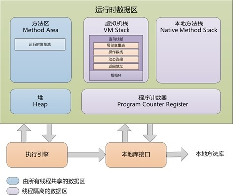

# JVM 内存结构与垃圾回收器

> 2018-06-26 (出处:[JVM 内存结构与垃圾回收总结](https://blog.csdn.net/fuzhongmin05/article/details/78169044))

---

## JVM 内存模型

JVM 只不过是运行在你系统上的另一个进程而已，这一切的魔法始于一个 java 命令。正如任何一个操作系统进程那样，JVM 也需要内存来完成它的运行时操作。记住：**JVM 本身是硬件的一层软件抽象，在这之上才能够运行 Java 程序，也才有了我们所吹嘘的平台独立性以及“一次编写，处处运行”**。

JAVA 虚拟机在执行 JAVA 程序的过程中，会把管理的内存划分为若干个不同的数据区域，如下图：



> **方法区(Method Area)**、**堆(Heap)**: 存储虚拟机加载的类信息常量静态变量，即时编译器编译后的代码，运行时常量池等。
>
> 垃圾回收区域，主要针对无用堆对象实例回收和常量池的回收和类型的卸载


### JVM 内存按功能划分

- 程序计数器：

  **线程私有，程序计数器是一块较小的内存空间，可以看作是当前线程锁执行的字节码行号指示器**。字节码解释器工作时就是通过改变这个计数器的值选取下一条需要执行的字节码指令，分支、循环、跳转、异常处理、线程恢复登记出功能都需要依赖这个计数器的值来完成。为了线程切换后能恢复到正确的执行位置，每个线程都需要有一个独立的程序计数器，各条线程之间的计数器互不影响，独立存储。这类内存区域称为“线程私有”的内存。程序计数器，是唯一一个在 JAVA 虚拟机规范中没有规定任何 Out Of Memory Error 的区域。

- JAVA 虚拟机栈：

  **线程私有、生命周期与线程相同。虚拟机栈描述的是 JAVA 方法执行的内存模型：每个方法在执行的同时，都会创建一个栈帧，用于存储局部变量表、操作数栈、动态链接、方法出口等信息**。平常我们把 java 分为堆内存和栈内存，其中的“栈”就是现在讲的虚拟机栈，或者说是虚拟机栈中局部变量表部分。**局部变量表所需的内存空间在编译期间完成分配，当进入一个方法时，这个方法需要在栈帧中分配多大的局部变量空间是完全确定的，在方法运行期间不会改变局部变量表的大小**。

  对于 JAVA 虚拟机栈，有两种异常情况：**如果线程请求的栈深度大于虚拟机所允许的深度，将抛出 StackOverflowError 异常；如果虚拟机栈在动态扩展时，无法申请到足够的内存，就会抛出 OutOfMemoryError**。

  JAVA 虚拟机的解释执行引擎被称为“基于栈的执行引擎”，其中所指的“栈”就是操作数栈。因此我们也称 JAVA 虚拟机是基于栈的，这点不同 Android 虚拟机, Android 虚拟机是基于寄存器的。

- 本地方法栈：

  **线程私有，本地方法栈和虚拟机栈所发挥的作用非常相似，它们之间的区别主要是，虚拟机栈是虚拟机执行 java 方法（字节码）服务的，而本地方法栈则为虚拟机使用到的 Native 方法服务。与虚拟机栈类似，本地方法栈也会抛出 StackOverflowError 和 OutOFMemoryError 异常**。

- JAVA 堆：

  **所有线程共享，java 堆在虚拟机启动时创建，是 JAVA 虚拟机所管理的内存中最大的一块。JAVA 堆的唯一目的就是存放对象实例和数组**。

  JAVA 堆是垃圾收集器管理的主要区域，因此也被称为"GC 堆"。从内存回收的角度看，由于现在的收集器大都采用分代收集算法，所以 JAVA 堆可以细分为：新生代和老年代；在细分点：Eden 空间、From Survivor 空间、From Survivor 空间等。从内存分配角度来看，线程共享的 JAVA 堆可以划分出多个线程私有的分配缓冲区。但是不管怎么划分，那个区域，存储的都是对象实例。

  JAVA 堆物理商不需要连续的内存，只要逻辑商连续即可。如果堆中没有内存完成实例分配，并且也无法再扩展时，将会抛出 OutOfMemoryError 异常。

- 方法区：

  **所有线程共享。用于存储已被虚拟机加载的类信息、常量、静态变量、即时编译器编译后的代码等数据。方法区也有一个别名叫做 Non-Heap（非堆）, 用于与 JAVA 堆区分**。对于 HotSpot 虚拟机来说，方法区又习惯称为"永久代"(Permancent Generation), 但这只是对于 HotSpot 虚拟机来说的，其他虚拟机的实现上并没有这个概念。相对而言，垃圾收集行为在这个区域比较少出现，但也并非不会来收集，**这个区域的内存回收目标主要是针对常量池的回收和对类型的卸载上。**

内存区域模型的总结如下图所示：


### 运行时数据区


- 线程私有的区域：程序计数器、虚拟机栈、本地方法栈；
- 所有线程共享的区域：JAVA 堆、方法区;
- 没有异常的区域：程序计数器;
- StackOverflow Error 异常：JAVA 虚拟机栈、本地方法栈；
- OutOfMemory Error 异常：除程序计数器外的其他四个区域，JAVA 虚拟机栈、本地方法栈、JAVA 堆、方法区；

> **为什么 JVM 要选用基于栈的架构？**
>
> JVM 选用基于栈的架构，就是 **所有的操作数必须先入栈，然后根据指令中的操作码选择从栈顶弹出若干个元素进行计算后再将结果压入栈中。** 在 JVM 中操作数可以存放在每一个栈帧中的一个本地变量集中，即在每个方法调用时就会给这个方法分配一个本地变量集，这个本地变量集在编译时就已经确定，所以操作数入栈可以直接是常量入栈或者从本地变量中取一个变量压入栈中。这和一般基于寄存器的操作有所不同，一个操作需要频繁地入栈和出栈，如进行一个加法运算，如果两个操作数都在本地变量中，那么一个加法操作就要有 5 次栈操作，分别是将两个操作数从本地变量入栈（2 次），再将两个操作数出栈（2 次）用于加法运算，再将结果压入栈顶（1 次）。**如果是基于寄存器的话，一般只需要将两个操作数存入寄存器进行加法运算后再将结果存入其中一个寄存器即可，不需要那么多的数据移动操作。那么为什么 JVM 还要选择基于栈来设计呢？**
>
> **因为 JVM 要设计成与平台无关，而平台无关性就要在没有或者很少寄存器的机器上也要同样能正确执行 JAVA 代码。**例如 80x86 的机器上寄存器就无规律，很难针对某一款机器设计通用的基于寄存器的指令，所以基于寄存器的架构很难做到通用。在手机操作系统方面，Google 的 Android 平台上的 Dalvik VM 就是基于特定芯片（ARM）设计的基于寄存器的架构，这样在特定芯片上实现基于寄存器的架构可能更多考虑性能，但是也牺牲了跨平台的移植性。

**栈是运行时的单位，而堆是存储的单位**

栈是解决程序的运行问题，即程序如何执行，或者说如何处理数据；堆解决的是数据存储的问题，即数据怎么放，放在哪儿。

在 JAVA 中的一个线程就会相应有一个线程栈与之对应，这点很容易理解，因为不同的线程执行逻辑有不同，因此需要一个独立的线程栈。而堆则是所有线程共享的。**栈因为是运行单位，因此里面存储的信息都是跟当前线程（或者程序）相关信息的，包括局部变量、程序运行状态。方法返回值等等；而堆只负责存储对象信息。**

堆和栈两者，**栈是程序运行最根本的东西，程序运行可以没有堆，但是不能没有栈。而堆是为栈进行数据存储服务，说白了堆就是一块共享的内存。不过，正是因为堆和栈的分离的思想，才使得 JAVA 的垃圾回收成为可能。**

**在 Java 中，Main 函数就是栈的起始点，也是程序的起始点**

程序要运行总是有一个起点的。同 C 语言一样，java 中的 Main 就是那个起点，无论什么 java 程序，找到 main 就找到了程序执行的入口。

> 程序运行永远都是在栈中进行的，因而参数传递时，只存在传递基本类型和对象引用的问题。不会直接传对象本身。

## JAVA 的对象访问定位

---

建立了对象是为了使用对象，我们对数据的使用是通过栈上的 reference 数据来操作堆上的具体对象，对于不同的虚拟机实现，reference 数据类型有不同的含义，主要是有如下两种访问方式：

1.  使用句柄访问。

    此时，JAVA 堆中将会划出一块内存来作为句柄池，reference 中存储的就是对象的句柄地址，**而句柄中包含了对象实例数据与对象类型数据各自的具体地址信息**，如下图：

    

2.  使用直接指针访问。

    此时，reference 中存储的就是对象的地址，如下图:

    

> 上面两种对象访问方式各有优势，
>
> **使用句柄访问的最大好处就是：** reference 中存储的是稳定的句柄地址，对象被移动（垃圾收集时移动对象是非常普遍的行为）时，只会改变句柄中的实例数据指针，而 reference 本身不需要修改；
>
> **使用直接指针访问方式的最大好处就是：**速度更快，它节省了一次指针定位时间开销（根据上图，节省的是对象实例数据的指针定位）, 由于对象的访问在 java 中非常频繁，因此，这类开销极少成多后也是一项非常客观的执行成本。对于 HotSpot 虚拟机而言，选择的就是第二种方式。

## 常见的 OOM 和 SOF

OOM 表示 Out Of Memory Error 异常，OOM 分为两种情况：内存溢出（Memory Overflow）和内存泄漏（Memory Leak）。

内存溢出，是指 **程序在申请内存时，没有足够的空间供其使用，出现了 Out Of Memory，也就是要求分配的内存超出了系统能给你的，系统不能满足需求，于是产生溢出。** 内存溢出分为上溢和下溢，比方说栈，栈满时再做进栈必定产生空间溢出，叫上溢，栈空时再做退栈也产生空间溢出，称为下溢。

有时候内存泄露会导致内存溢出，所谓内存泄露（memory leak），是 **指程序在申请内存后，无法释放已申请的内存空间**，一次内存泄露危害可以忽略，但内存泄露堆积后果很严重，无论多少内存，迟早会被占光，举个例子，就是说系统的篮子（内存）是有限的，而你申请了一个篮子，拿到之后没有归还（忘记还了或是丢了），于是造成一次内存泄漏。在你需要用篮子的时候，又去申请，如此反复，最终系统的篮子无法满足你的需求，最终会由内存泄漏造成内存溢出。

经常遇到的 OOM 有两种:

1.  Java Heap 溢出

    Java 堆用于存储对象实例，我们只要不断的创建对象，而又没有及时回收这些对象（即内存泄漏），就会在对象数量达到最大堆容量限制后产生内存溢出异常。

2.  方法区溢出

    方法区用于存放 Class 的相关信息，如类名、访问修饰符、常量池、字段描述、方法描述等。方法区溢出也是一种常见的内存溢出异常，一个类如果要被垃圾收集器回收，判定条件是很苛刻的。在经常动态生成大量 Class 的应用中，要特别注意这点。异常信息：Java.lang.OutOfMemoryError:PermGen space。

**SOF 表示 Stack Overflow，即堆栈溢出。当应用程序递归太深而发生堆栈溢出时，抛出该错误。因为栈一般默认为 1—2M，一旦出现死循环或者是大量的递归调用，在不断的压栈过程中，造成栈容量超过 1M 而导致溢出。栈溢出的原因总结：a.递归调用；b.大量循环或死循环；c.全局变量是否过多；d.数组、List、Map 数据过大。**

## 哪些内存需要被回收

---

根据 Java 内存模型，其中，**程序计数器、虚拟机栈、本地方法栈 3 个区域随线程而生，随线程而灭；栈中的栈帧随着方法的进入和退出有条不紊地执行着出栈和入栈操作。每一个栈帧中分配多少内存基本上是在类结构确定下来时就已知的，因此这几个区域的内存分配和回收都具备确定性**，故这几个区域就不需要过多考虑回收的问题，因为方法结束或者线程结束时，内存自然就跟着回收了。

对于 java 堆和方法区则不一样，java 堆是存放实例对象的地方，我们只有在程序运行期间才能知道会创建哪些对象，这部分内存的分配和回收是动态的，因此，垃圾收集器所关注的就是这一部分。

对于方法区（或者说 HotSpot 虚拟机中的永久代），垃圾回收的主要是回收两部分内容：废弃常量和无用的类。对于废弃常量，主要是判断当前系统中有没有对象引用这个常量；对于无用的类则比较严格，需要满足下面三个条件：

    1. 该类的所有实例都已经被回收，即堆中不存在该类任何实例；
    2. 加载该类的ClassLoader已经被回收；
    3. 对类对应的java.lang.Class对象没有在任何地方被引用，无法再任何地方通过反射访问该类的方法；

满足了上面三个条件也仅仅是“可以”进行回收了，还要根据 HotSpot 的一些配置参数综合考虑。

在 Java 中静态内存分配是指在 Java 被编译时就已经能够确定需要的内存空间，当程序被加载时系统把内存一次性分配给它。这些内存不会在程序执行时发生变化，直到程序执行结束时内存才被回收。**在 Java 的类和方法中的局部变量包括原生数据类型（int、long、char 等）和对象的引用都是静态分配内存的**，如下面这段代码：

```java
public void staticData(int arg) {
    String s = “String”;
    long l = 1;
    Long lg = 1L;
    Object o = new Object();
    Integer i = 0;
}
```

其中参数 arg、l 是原生的数据类型，s、o 和 i 是指向对象的引用。在 Javac 编译时就已经确定了这些变量的静态内存空间。其中 arg 会分配 4 个字节，long 会分配 8 个字节，String、Long、Object 和 Integer 是对象的类型，它们的引用会占用 4 个字节空间，这个方法占用的静态内存空间是 4 + 4 + 8 + 4 + 4 + 4 = 28 字节。

**静态内存空间是在 Java 栈上分配的，当这个方法运行结束时，对应的栈帧也就撤销，所以分配的内存空间也就回收了。**

在上面的代码中，变量 lg 和 i 存储的值虽然与 l 和 arg 变量一样，但是它们的存储位置是不一样的，后者是原生的数据类型，它们存储在 Java 栈中，方法执行结束就会消失，而前者是对象类型，它们存储在 Java 堆中，它们是可以被共享的，也不一定随着方法执行结束而消失。变量 l 和 lg 的内存空间大小显然也是不一样的，l 在 Java 栈中被分配 8 个字节空间，而 lg 被分配 4 个字节的地址指针空间这个地址指针指向 lg 对象在堆中的地址。很显然在堆中 Long 类型数字 1 肯定不只 8 个字节，所以 Long 代表的数字肯定比 long 类型占用的空间大很多。

在 Java 中，**对象的内存空间是动态分配的，所谓的动态分配就是在程序执行时才知道要分配的存储空间大小，而不是在编译时就能够确定的**。lg 代表的 Long 对象，只有 JVM 在解析 Long 类时才知道这个类中有哪些信息，这些信息都是哪些类型，然后再为这些信息分配相应的存储空间存储相应的值。而这个对象什么时候被回收也是不确定的，只有等到这个对象不再使用时才会被回收。

## 基于分代策略的垃圾回收

---

分代的垃圾回收策略，是基于这样一个事实：**不同的对象的生命周期是不一样的。因此，不同生命周期的对象可以采取不同的收集方式，以便提高回收效率**。

在 Java 程序运行的过程中，会产生大量的对象，其中有些对象是与业务信息相关，比如 Http 请求中的 Session 对象、线程、Socket 连接，这类对象跟业务直接挂钩，因此生命周期比较长。但是还有一些对象，主要是程序运行过程中生成的临时变量，这些对象生命周期会比较短，比如：String 对象，由于其不可变类的特性，系统会产生大量的这些对象，有些对象甚至只用一次即可回收。

试想，在不进行对象存活时间区分的情况下，每次垃圾回收都是对整个堆空间进行回收，花费时间相对会长，同时，因为每次回收都需要遍历所有存活对象，但实际上，对于生命周期长的对象而言，这种遍历是没有效果的，因为可能进行了很多次遍历，但是他们依旧存在。因此，**分代垃圾回收采用分治的思想，进行代的划分，把不同生命周期的对象放在不同代上，不同代上采用最适合它的垃圾回收方式进行回收**。


如上图所示、虚拟机中的共划分为三个代：**年轻代（Young Generation）、年老点（Old Generation）和持久代（Permanent Generation）。其中持久代属于方法区（也称非堆），主要存放的是 Java 类的类信息，与垃圾收集器要收集的 Java 对象关系不大。年轻代和年老代的划分是对垃圾收集影响比较大的**。

这三个区存放的内容有如下区别：

1.  Young 区

    又分为 Eden 区和两个 Survivor 区，其中新创建的对象都在 Eden 区，**当 Eden 区满后会触发 minor GC 将 Eden 区仍然存活的对象复制到其中一个 Survivor 区中，另外一个 Survivor 区中的存活对象也复制到这个 Survivor 区，以保证始终有一个 Survivor 区是空的**。需要注意，**两个 Survivor 区是对称的，没有先后关系**，所以同一个区中可能同时存在从 Eden 复制过来对象，和从前一个 Survivor 复制过来的对象，而复制到年老区的只有从第一个 Survivor 去过来的对象。根据程序需要，Survivor 区是可以配置为多个的（多于两个），这样可以增加对象在年轻代中的存在时间，减少被放到年老代的可能

2.  Old 区

    存放的 **Young 区的 Survivor 满后触发 minor GC 后仍然存活的对象，当 Eden 区满后会将对象存放到 Survivor 区中，如果 Survivor 区仍然存不下这些对象，GC 收集器会将这些对象直接存放到 Old 区**。如果 Survivor 区中的对象足够老，也直接存放到 Old 区。**如果 Old 区也满了，将会触发 Full GC，回收整个堆内存**。在年轻代中经历了 N 次垃圾回收后仍然存活的对象，就会被放到年老代中。因此，可以认为年老代中存放的都是一些生命周期较长的对象。

3.  Perm 区

    存放的主要是类的 Class 对象，Class 对象就像其他存储在堆中的对象一样，Class 对象也和 Object 对象一样被存储和 GC。**如果一个类被频繁地加载，也可能导致 Perm 区满，Perm 区的垃圾回收也是由 Ful GC 触发的。Full GC 对整个内存进行整理，包括 Young、Old 和 Perm，持久代大小通过-XX:MaxPermSize=<N>进行设置**。

Full GC 因为需要对整个堆进行回收，所以很慢，因此应该尽可能减少 Full GC 的次数。在对 JVM 调优的过程中，很大一部分工作就是对于 Full GC 的调节。有如下原因可能导致 Full GC：

    1. 年老代（Tenured）被写满;
    2. 持久代（Perm）被写满;
    3. System.gc()被显示调用;
    4. 上一次GC之后Heap的各域分配策略动态变化。

> **Minor GC:** 即新生代 GC，指发生在新生代的垃圾收集动作，因为 Java 对象大多都具备朝生夕灭的特性，所以 Minor GC 非常频繁，一般回收速度也比较快。
>
> **Major GC/Full GC:** 即老年代 GC，指发生在老年代的 GC，出现了 Major GC，经常会伴随至少一次的 Minor GC（非绝对），Major GC 的速度一般会比 Minor GC 慢 10 倍以上。

## 理解 GC 日志

---

阅读 GC 日志是处理 Java 虚拟机内存问题的基础技能，它只是一些人为确定的规则，没有太多技术含量。

每一种收集器的日志形式都是由它们自身的实现所决定的，换而言之，每个收集器的日志格式都可以不一样。但虚拟机设计者为了方便用户阅读，将各个收集器的日志都维持一定的共性，例如以下两段典型的 GC 日志：

```log
33.125：[GC[DefNew：3324K-＞152K(3712K)，0.0025925 secs]
3324K-＞152K(11904K)，0.0031680 secs]

100.667：[Full GC[Tenured：0 K-＞210K(10240K)，0.0149142 secs]
4603K-＞210K(19456K)，[Perm：2999K-＞2999K(21248K)]，0.0150007
secs][Times：user=0.01 sys=0.00，real=0.02 secs]
```

最前面的数字“33.125”和“100.667” **代表了 GC 发生的时间，这个数字的含义是从 Java 虚拟机启动以来经过的秒数**。

GC 日志 **开头的“[GC”和“[Full GC”说明了这次垃圾收集的停顿类型，而不是用来区分新生代 GC 还是老年代 GC 的。如果有“Full”，说明这次 GC 是发生了 Stop-The-World 的（stop-the-world 停顿类型表示垃圾收集器在收集垃圾过程中暂停了所有其他的工作线程，直到它收集结束）**。

接下来的“[DefNew”、“[Tenured”、“[Perm”表示 GC 发生的区域，这里显示的区域名称与使用的 GC 收集器是密切相关的，例如上面样例所使用的 Serial 收集器中的新生代名为“DefaultNew Generation”，所以显示的是“[DefNew”。如果是 ParNew 收集器，新生代名称就会变为“[ParNew”，意为“Parallel New Generation”。如果采用 Parallel Scavenge 收集器，那它配套的新生代称为“PSYoungGen”，老年代和永久代同理，名称也是由收集器决定的。

后面方括号内部的“3324K-＞ 152K（3712K）”含义是“ **GC 前该内存区域已使用容量-＞ GC 后该内存区域已使用容量（该内存区域总容量）**”。而在方括号之外的“3324K-＞ 152K（11904K）”表示“ **GC 前 Java 堆已使用容量-＞ GC 后 Java 堆已使用容量（Java 堆总容量）**”。

再往后，“0.0031680 secs”表示该内存区域 GC 所占用的时间，单位是秒。有的收集器会给出更具体的时间数据，如“[Times：user=0.01 sys=0.00，real=0.02 secs]”，这里面的 user、sys 和 real 与 Linux 的 time 命令所输出的时间含义一致，**分别代表用户态消耗的 CPU 时间、内核态消耗的 CPU 时间和操作从开始到结束所经过的墙钟时间（Wall Clock Time）**。CPU 时间与墙钟时间的区别是，墙钟时间包括各种非运算的等待耗时，例如等待磁盘 I/O、等待线程阻塞，而 CPU 时间不包括这些耗时，但当系统有多 CPU 或者多核的话，多线程操作会叠加这些 CPU 时间，所以读者看到 user 或 sys 时间超过 real 时间是完全正常的。

## 经验及 JVM 参数分析

---

**大对象会直接进入老年代，所谓大对象就是指，需要大量连续内存空间的 Java 对象，最典型的大对象就是那种很长的字符串及数组（下面例子中的 byte[]数组就是典型的大对象）。大对象对虚拟机的内存分配来说就是一个坏消息，替 Java 虚拟机抱怨一句，比遇到一个大对象更加坏的消息就是遇到一群“朝生夕灭”的“短命大对象”，写程序的时候应当避免。经常出现大对象容易导致内存还有不少空间时就提前触发垃圾收集以获取足够的连续空间来“安置”它们**。

虚拟机提供了一个-XX:PretenureSizeThreshold 参数，令大于这个设置值的对象直接在老年代中分配。这样做的目的是避免在 Eden 区及两个 Survivor 区之间发生大量的内存拷贝。

```java
private static final int _1MB = 1024 * 1024;
/**  
 1. VM参数：-verbose:gc -Xms20M -Xmx20M -Xmn10M
 2. -XX:SurvivorRatio=8 -XX:PretenureSizeThreshold=3145728
*/  
public static void testPretenureSizeThreshold() {  
　byte[] allocation;  
　allocation = new byte[4 * _1MB];  //直接分配在老年代中  
}
```

运行结果：

```log
Heap  
def new generation   total 9216K, used 671K
[0x029d0000, 0x033d0000, 0x033d0000)  
 eden space 8192K,   8% used [0x029d0000, 0x02a77e98, 0x031d0000)  
 from space 1024K,   0% used [0x031d0000, 0x031d0000, 0x032d0000)  
 to   space 1024K,   0% used [0x032d0000, 0x032d0000, 0x033d0000)  
tenured generation   total 10240K, used 4096K
[0x033d0000, 0x03dd0000, 0x03dd0000)  
  the space 10240K,  40% used [0x033d0000,
0x037d0010, 0x037d0200, 0x03dd0000)  
compacting perm gen  total 12288K, used 2107K
[0x03dd0000, 0x049d0000, 0x07dd0000)  
  the space 12288K,  17% used [0x03dd0000,
0x03fdefd0, 0x03fdf000, 0x049d0000)  
No shared spaces configured.
```

执行代码中的 testPretenureSizeThreshold()方法后，我们看到 Eden 空间几乎没有被使用，而老年代 10MB 的空间被使用了 40%，也就是 4MB 的 allocation 对象直接就分配在老年代中，这是因为 PretenureSizeThreshold 被设置为 3MB（就是 3145728B，这个参数不能与-Xmx 之类的参数一样直接写 3MB），因此超过 3MB 的对象都会直接在老年代中进行分配。

不管是 Minor GC 还是 Full GC，**GC 过程中都会导致程序运行中中断，正确的选择不同的 GC 策略，调整 JVM 的 GC 参数，可以极大的减少由于 GC 工作而导致的程序运行中断方面的问题，进而适当的提高 Java 程序的工作效率**。但是调整 GC 是一个极为复杂的过程，由于各个程序具备不同的特点，如：web 和 GUI 程序就有很大区别（Web 可以适当的停顿，但 GUI 的停顿是客户无法接受的），而且由于跑在各个机器上的配置不同（主要是 cup 个数及内存容量不同），所以使用的 GC 种类也会不同。

JVM 主要参数及其含义解释如下图所示：
|参数名称|含义|默认值及说明|
|-|-|-|
|-Xms|初始堆大小|物理内存的 1/64(<1GB),默认(MinHeapFreeRatio 参数可以调整)空余堆内存小于 40%时，JVM 就会增大堆直到-Xmx 的最大限制|
|-Xmx|最大堆大小|物理内存的 1/4(1<1GB),默认(MaxHeapFreeRatio 参数可以调整)空余堆内存大于 70%时，JVM 会减少堆直到-Xms 的最小限制|
|-Xmn|年轻代大小|此处的大小是(eden+2 survivor space), 与 jmap -heap 中显示的 New gen 是不同的。**整个堆大小=年轻代大小 + 年老代大小**。增大年轻代后，将会减少年老代大小，此值堆系统性能影响较大，Sun 官方推荐配置为整个堆的 3/8|
|-XX:NewSize|设置年轻代大小| |
|-XX:MaxNewSize|设置年轻代最大值| |
|-XX:PermSize|设置持久代初始值|默认物理内存的 1/64|
|-XX:MaxPermSize|设置持久代最大值|默认物理内存的 1/64|
|-XX:NewRatio|年轻代(包括 Eden 和两个 Survivor 区)与年老代的比值(除去持久代)|-XX:NewRatio=4 表示年轻代与年老代所占比值是 1:4，年轻代占整个堆的 1/5，Xms=Xmx 并且设置了 Xmn 的情况下，该参数不需要进行设置|
|-XX:SurvivorRatio|Eden 区与 Survivor 区的大小比值|设置为 8 时,则两个 Survivor 区与一个 Eden 区的比值为 2:8, 一个 Survivor 区占整个年轻代的 1/10|
|-XX:InitialServivorRatio|默认情况下 Eden 区与 Survivor 区的大小比值|-XX:SurvivorRatio 未设置时，以这个参数的值为准，这个参数默认为 8，表示 Eden：From Space: To Space=8:1:1|
|-XX:+UseSerialGC|指定 JVM 使用串行垃圾收集器| |
|-XX:+PrintGCDetails|打印 GC 日志| |
|-XX:+PrintGCDateStamps|打印 GC 发生的时间|记录的是系统时间|
|-XX:+PrintGCTimeStamps|打印 GC 发生的时间戳|这个选项记录的是 JVM 启动时间为起点的相对时间|
|-Xss|每个线程的栈大小|JDK5.0 以后每个线程堆栈大小为 1M, 以前每个线程堆栈大小为 256K。根据应用的线程所需内存大小进行调整，在相同物理内存下，减少这个值能生成更多的线程。但是操作系统对一个进程内的线程数还是有限制的，不能无限生成，经验值在 3000~5000 左右，一般小的应用，如果栈不是很深，应该是 128K 够用的，大的应用建议使用 256K。这个选项堆性能影响比较大，需要严格的测试。|
|-XX:+PrintHeapAtGC|打印 GC 前后的详细堆栈信息| |
|-XX:MaxTenuringThrehold|晋升到老年代的对象年龄|每个对象在坚持过一次 Minor GC 之后，年龄就会加 1, 当超过这个参数值时就进入老年代|
|-XX:PretenureSizeThreshold|直接晋升到老年代的对象大小|设置这个参数后，大于这个参数的对象将直接在老年代分配|
|-verbose:class|在输出设备上显示虚拟机运行时的类加载信息| |
|-verbose:gc|在虚拟机发生内存回收时输出设备显示信息|-verbose:gc 与-XX:PrintGC 的效果相同|
|-verbose:jni|输出 native 方法调用的相关情况| |

当发生 Minor GC 时，除了将 Eden 区的非活动对象回收以外，还会把一些老对象也复制到 Old 区中。这个老对象的定义是通过配置参数 MaxTenuringThrehold 来控制的，如-XX:MaxTenuringThrehold=10，则表示如果这个对象已经被 Minor GC 回收过 10 次后仍然存活，那么这个对象在这次 Minor GC 后直接进入 Old 区。

JVM 提供了大量命令行参数，打印信息，供调试使用。主要有以下一些：

-XX:+PrintGC 的输出形式如下：

```log
[GC 118250K->113543K(130112K), 0.0094143 secs] [Full GC
121376K->10414K(130112K), 0.0650971 secs]
```

-XX:+PrintGCDetails 输出形式：

```log
[GC [DefNew: 8614K->781K(9088K), 0.0123035 secs] 118250K-
>113543K(130112K), 0.0124633 secs] [GC [DefNew: 8614K-
>8614K(9088K), 0.0000665 secs][Tenured: 112761K-
>10414K(121024K), 0.0433488 secs] 121376K->10414K(130112K), 0.0436268 secs]
```

-XX:+PrintGCApplicationConcurrentTime：打印每次垃圾回收前，程序未中断的执行时间。可与上面混合使用。输出形式：

```log
Application time: 0.5291524 seconds
```

-XX:+PrintGCApplicationStoppedTime：打印垃圾回收期间程序暂停的时间。可与上面混合使用。输出形式：

```log
Total time for which application threads were stopped: 0.0468229 seconds
```

## JVM 内存设置指导原则

---

1.  年轻代大小选择

    响应时间优先的应用：尽可能设大，直到接近系统的最低响应时间限制（根据实际情况选择）。在此种情况下，年轻代垃圾收集发生的频率也是最小的。同时，减少到达年老代的对象。

    吞吐量（不算 gc 时间后的工作时间占总时间的比值）优先的应用：尽可能设置大，可能到达 Gbit 的程度。因为对响应时间没有要求，垃圾收集可以并行进行，一般适合 8CPU 以上的应 用。

    避免设置过小的年轻代，当年轻代设置过小时会导致：① 年轻代 GC 次数更加频繁，② 可能导致年轻代 GC 后的存活对象直接进入老年代，如果此时老年代满了，会触发 Full GC。

2.  年老代大小选择

    响应时间优先的应用：**年老代使用并发收集器，所以其大小需要小心设置，一般要考虑并发会话率和会话持续时间等一些参数**。如果堆设置小了，可以会造成内存碎片，高回收频率以及应用暂停而使用传统的标记-清除方式；如果堆大了，则需要较长的收集时间。最优化的方案，一般需要参考以下数据获得：并发垃圾收集信息、持久代并发收集次数、传统 GC 信息、花在年轻代和年老代回收上的时间比例。

3.  较小堆引起的碎片问题

    因为 **年老代的并发收集器使用标记-清除算法，所以不会对堆进行压缩**。当收集器回收时，他会把相邻的空间进行合并，这样可以分配给较大的对象。但是，当堆空间较小时，运行一段时间以后，就会出现“碎片”，如果并发收集器找不到足够的空间，那么并发收集器将会停止，然后使用传统的标记-清除方式进行回收。如果出现“碎片”，可能需要进行如下配置：

    -XX:+UseCMSCompactAtFullCollection：使用并发收集器时，开启对年老代的压缩。

    -XX:CMSFullGCsBeforeCompaction=0：上面配置开启的情况下，这里可设置多少次 Full GC 后，对年老代进行压缩。
