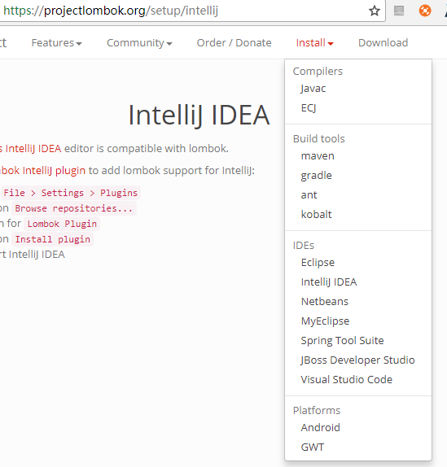

# Lombok 的使用及原理

> 什么是 Lombok, Lombok 是一个可以通过简单的注解形式来帮助我们简化消除一些必须有但显得很臃肿的 Java 代码的工具，通过使用对应的注解，可以在编译源码的时候生成对应的方法。官方地址: https://projectlombok.org/， github 地址：https://github.com/rzwitserloot/lombok。

Lombok 是通过注解在 Java 编译器生成代码的工具，通过使用其内置的一些注解如：@Getter, @Setter, @Data 等，可以在编译期间生成 getter，setter，构造器，builder 等代码。

在 Maven 项目中，如下需要使用到 Lombok 工具，在 pom.xml 文件中引入如下依赖：

```xml
<dependencies>
	<dependency>
		<groupId>org.projectlombok</groupId>
		<artifactId>lombok</artifactId>
		<version>1.18.0</version>
		<scope>provided</scope>
	</dependency>
</dependencies>
```

在 Intellij Idea 工具中，如果需要使用 lombok，需要加入 Lombok Intellij plugin。如官方指示：

- Go to **File > Settings > Plugins**
- Click on **Browse repositories...**
- Search for **Lombok Plugin**
- Click on **Install plugin**
- Restart IntelliJ IDEA

不同的开发工具，使用的插件是不一样的，具体信息参考官方安装文档：



## Lombok 的使用

以下介绍几个常用的注解：

- @Getter / @Setter:

  可以作用在类商或者属性商，放在类商，会对所有的非静态属性生成 Getter/Setter 方法，放在属性上，会堆该属性生成 Getter/Setter 方法。并且可以指定 Getter/Setter 方法的访问级别。

- @Data:

  包含@ToString, @EqualsAndHashCode，所有属性的@Getter，所有 non-final 属性的@Setter 和@RequiredArgsConstructor 的组合，通常情况下，基本使用这个注解就足够了。

- @EqualsAndHashCode:

  默认情况下，会使用非瞬态(non-transient)和非静态(non-static)字段来生成 equals 和 hascode 方法，也可以指定具体使用那些属性。

- @ToString:

  生成 toString 方法，默认情况下，会输出类名、所有属性值、属性会按顺序输出，以逗号分割。可以使用@ToString(of="att1")或@ToString(of={"att1", "att2"})指定指定输出具体值，也可使用@ToString(exclude="att1")或@ToString(exclude={"att1", "att2"})排除不需要输出的属性值信息。

- @NoArgsConstructor, @RequiredArgsConstructor and @AllArgsConstructor:

  无参构造器、部分参数构造器、全参构造器，当我们需要重装多个构造器的时候，Lombok 就无能为力了。

- @NonNull:

  主要是判断一个参数值是否为空，如果为空，会抛出空指针异常，另外，如果在对象属性中配置注解了@NonNull，在创建该对象时构造器会带上该属性的参数输入。如下引用官方代码例子：

  使用 Lombok:

  ```java
    import lombok.NonNull;

    public class NonNullExample extends Something {
        private String name;

        public NonNullExample(@NonNull Person person) {
            super("Hello");
            this.name = person.getName();
        }
    }
  ```

  编译后的代码如下:

  ```java
    import lombok.NonNull;
    public class NonNullExample extends Something {
        private String name;

        public NonNullExample(@NonNull Person person) {
            super("Hello");
            if (person == null) {
                throw new NullPointerException("person is marked @NonNull but is null");
            }
            this.name = person.getName();
        }
    }
  ```

> 更多的注解以及解释，请参考官方文档：https://projectlombok.org/features/all。

**注意点:** 测试使用@Data 注解，不会覆盖自己在类中编写的 Getter/Setter 方法内容。如下代码：

```java
import lombok.Data;
import lombok.NonNull;
import lombok.ToString;

@Data
@ToString(exclude = {"age", "parentUser"})
public class User {

    @NonNull
    private Integer id;

    private String name;

    private int age;

    private User parentUser;

    private String desc;

    public String getDesc() {
        return id + ":" + name + "[" + age + "]" ;
    }
}
```

在调用 getDesc 的结果时，出处的是自己编写的这个内容，编写内容会覆盖 Lombok 自动生成的方法。

## Lombok 原理

Lombok 通过添加注解的方式来生成代码，在 JDK1.5 引入注解的同时，也引入了两种注解的方式：

1.  运行是通过反射解析

    运行是能够解析的注解，必须将@Retention 设置为 RUNTIME，这样可以通过反射获取该注解。一下是常用的解析注解 API：

    ```java
    boolean isAnnotationPresent(Class annotationClass);
    T getAnnotation(Class annotationClass);
    Annotation[] getAnnotations();
    ```

2.  编译时期解析

    编译是解析注解主要有两种方式: Annotation Processing Tool 以及 Pluggable Annotation Processing API。

    - Annotation Processing Tool:

      APT 来自 JDK5，在 JDK7 中不推荐使用，JDK8 中已经彻底删除了。从 JDK6 以后，可以使用 Pluggable Annotation Processing API 来替代它。APT 被废弃的主要原因如下：

      > 1.  APT 集成在 com.sun.mirror 非标准包下；
      > 2.  没有集成到 javac 中，需要额外运行

    - Pluggable Annotation Processing API:

      JSR 269 在 JDK6 中被引入，作为 APT 的替代方案。javac 执行的时候会调用 Pluggable Annotation Processing API, 因此我们可以通过实现此 API 来改变编译期的一些行为从而达到目的，具体的编译流程如下图 javac 执行流程：

      

      > 1.  javac 使用编译器堆源码进行分析，生成一个抽象的语法树(AST)
      > 2.  javac 编译器运行程序
      > 3.  程序完成逻辑，一般是修改此语法树
      > 4.  javac 使用修改后的语法树生成可执行的字节码文件
      >
      > Lombok 便是通过 Pluggable Annotation Processing API 来实现代码生成的。

## 总结

个人认为，虽然使用 Lombok 能使部分代码看起来简洁，但是实用性感觉不大，而且会导致代码的可读性变差。

> 参考：[Lombok 原理](https://www.jianshu.com/p/302c56f9574d) [Lombok 使用与原理](https://juejin.im/entry/59d85f71f265da064a0f7179)
