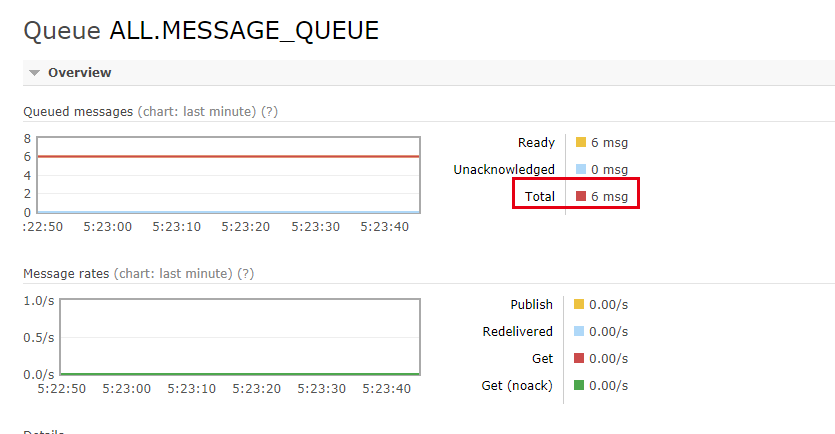

# Rabbitmq 延时队列

参考：https://blog.csdn.net/u014308482/article/details/53036770<br/>
官方文档: https://www.rabbitmq.com/dlx.html<br/>
官方文档: https://www.rabbitmq.com/ttl.html

> “延时消息”是值当消息被发送以后，并不想让消费者立即拿到消息，而是等待指定时间后，消费者才拿到这个消息进行消费。

比如常见的场景：在订单系统中，用户下单后，通常有 30 分钟的时间进行支付，如果 30 分钟之内没有支付成功，那么这个订单将进行另外的处理。这种就可以通过使用延时队列将订单信息发送到延时队列。

## RabbitMQ 如果实现延时队列？

> RabbitMQ AMQP 写意思和 RabbitMQ 队列本身没有直接支持延时队列的功能，但是可以通过它的特性，模拟出延时队列的功能。主要有两个特性来曲线实现延时队列功能：

- 特性 1：Time To Live(TTL)

  RabbitMQ 可以针对 QUEUE 设置 `x-expires` 或者针对 Message 设置 `x-message-ttl`，来控制消息的生存时间，如果超时(两者同时设置以最先到期的时间为准)，则消息会变成 Deal Letter(死信)

  RabiitMQ 针对队列中的消息过期时间有两种方法可以设置。

        + 通过队列属性设置，队列中所有消息都有相同的过期时间。
        + 堆消息进行单独设置，每条消息TTL可以不同。

  如果同时使用，则消息的过期时间以两者之间 TTL 较小的那个数值为准。消息在队列的生存时间一旦超过设置的 TTL 值，就变成了 Deal Letter。

  > _注意：经过测试，消息的到期时间到了，但是消息不是在队列中最前的消息(第一个消息)，则消息不会马上变成死信，只会等到改消息处于队列最前端时才会把消息变成死信消息。_

- 特性 2: Deal Letter Exchanges(DLX)

  RabbitMQ 的 QUEUE 可以配置 `x-deal-letter-exhange` 和 `x-deal-letter-routing-key` (可选)两个参数，如果队列内出现 deal letter，则按照这两个参数重新路由转发到指定的队列。

        + `x-deal-letter-xechange`：出现Deal Letter 之后将Deal Letter重新发送到指定的exchange。
        + `x-deal-letter-routing-key`: 出现Deal Letter之后将Deal Letter重新按照指定的 `routing-key` 发送(如果没有配置，则按消息原来的 `routing-key` 发送)。

  队列出现 Deal Letter 的情况有： + 消息或者队列的 TTL 过期 + 队列达到最大长度 + 消息被消息端拒绝(basic.reject or basic.nack) 并且 requeue=false

综合上述两个特性，设置 TTL 规则之后当消息在一个队列中变成死信时，利用 DLX 特性它能被重新转发到另一个 Exchange 或者 Routing Key，这时消息就可以重新被消费了。

## 测试案例

> 测试代码参考: [GitHub](https://github.com/lanzhu259X/test_project/tree/master/src/main/java/com/lanzhu/testwork/rabbitmq): https://github.com/lanzhu259X/test_project/tree/master/src/main/java/com/lanzhu/testwork/rabbitmq

- 通过设置消息的期时间

生产者：创建 10 个消息，但是每个消息的有效期时长不一样，30 秒+一个随机数(30 秒到 60 秒之间)，发送两种路由的两种消息。代码如下(使用了 lombok 工具)：

```java
package com.lanzhu.testwork.rabbitmq;

import com.rabbitmq.client.AMQP;
import lombok.extern.slf4j.Slf4j;
import org.apache.commons.lang3.RandomUtils;
import org.springframework.beans.factory.annotation.Autowired;
import org.springframework.stereotype.Service;

import java.util.Date;

/**
 * 生产者A, 生成消息，发送到MQ中
 */
@Slf4j
@Service
public class Producer {

    @Autowired
    private MQConfig mqConfig;

    /**
     * 模拟生成消息放入到MQ中
     */
    public void createMQMessage() {
        int i = 10;
        while (i > 0) {
            i--;
            Long randomNum = 30000L + RandomUtils.nextLong(0L, 30000L); //有效时长为30到60秒
            //生产一个Message
            Message message = null;
            boolean isB = i % 3 == 0;
            if (isB) {
                message = new MessageB();
                message.setInfo("MessageB_" + i);
            }else {
                message = new MessageA();
                message.setInfo("MessageA_" + i);
            }
            message.setId(i);
            message.setTtl(randomNum);
            message.setCreateTime(new Date());

            AMQP.BasicProperties properties = new AMQP.BasicProperties.Builder()
                    .expiration(String.valueOf(randomNum)) //设置消息的有效时长
                    .build();
            if (i == 5) {
                //如果是ID==5的，设置为永久存在类型的消息
                message.setTtl(null);
                properties = null;
            }
            log.info("========> Create a message: {}", message.toString());
            mqConfig.sendMQMessage("ProducerA", (isB ? MQConfig.B_ROUTE_KEY : MQConfig.A_ROUTE_KEY), message, properties);
            try {
                //暂停5秒
                Thread.sleep(1000);
            } catch (InterruptedException e) {
                e.printStackTrace();
            }
        }
        log.info("--------------> Create message End.");
    }
}
```

建立一个正常接收消息的队列，本例子中接收所有的两种消息，这个队列设置了死信的 exchange，没有消费着，让消息自动达到有效期来制造死信消息，代码如下：

```java
package com.lanzhu.testwork.rabbitmq;

import com.rabbitmq.client.Channel;
import com.rabbitmq.client.Connection;
import lombok.extern.slf4j.Slf4j;
import org.springframework.beans.factory.annotation.Autowired;
import org.springframework.stereotype.Component;

import javax.annotation.PostConstruct;
import java.util.HashMap;
import java.util.Map;

@Slf4j
@Component
public class NormalConsumer {

    @Autowired
    private MQConfig mqConfig;

    @PostConstruct
    public void initConsumer() {

        try {
            Connection connection = mqConfig.getConnection();

            //声明一个接受死信的交换器
            Channel channel = connection.createChannel();
            channel.exchangeDeclare(MQConfig.DEAL_EXCHANGE, MQConfig.TOPIC_TYPE);

            //声明正常的交换器
            channel.exchangeDeclare(MQConfig.EXCHANGE, MQConfig.TOPIC_TYPE);

            //声明一个队列，接受全部的消息类型，当出现私信时，把死信转到交换器MQConfig.DEAL_EXCHANGE
            Map<String, Object> map = new HashMap<String, Object>();
            map.put("x-dead-letter-exchange", MQConfig.DEAL_EXCHANGE);

            channel.queueDeclare("ALL.MESSAGE_QUEUE", false, false, false, map);
            // 绑定队列到交换器和监听的的路由
            channel.queueBind("ALL.MESSAGE_QUEUE", MQConfig.EXCHANGE, MQConfig.ALL_ROUTE_KEY);
            //不绑定具体的消费者

            log.info("-----------> Init Normal consumer success.");

        }catch (Exception e) {
            log.error("Init Normal Consumer fail.", e);
        }
    }
}
```

定义了两个消息者，这两个消费者绑定在死信的 Exchange 上，用于接受和消费死信消息。代码如下：

消费者 A：

```java
package com.lanzhu.testwork.rabbitmq;

import com.alibaba.fastjson.JSON;
import com.rabbitmq.client.*;
import lombok.extern.slf4j.Slf4j;
import org.springframework.beans.factory.annotation.Autowired;
import org.springframework.stereotype.Component;

import javax.annotation.PostConstruct;
import java.io.IOException;

@Slf4j
@Component
public class DealLetterConsumerA {

    @Autowired
    private MQConfig mqConfig;

    @PostConstruct
    public void initConsumer() {
        try {
            Connection connection = mqConfig.getConnection();
            Channel channel = connection.createChannel();

            channel.exchangeDeclare(MQConfig.DEAL_EXCHANGE, MQConfig.TOPIC_TYPE);

            //声明一个队列，接受死信交换器接受过来的路由为message.a 的消息
            channel.queueDeclare("DEAL_A_QUEUE", false, false, false, null);
            //把队列绑定到交换器DEAL_EXCHANGE
            channel.queueBind("DEAL_A_QUEUE", MQConfig.DEAL_EXCHANGE, MQConfig.A_ROUTE_KEY);
            //绑定一个消费者，接受处理死信A队列的消息
            channel.basicQos(1); //一次接受一个消息
            channel.basicConsume("DEAL_A_QUEUE", false, new ConsumerA(channel));


        }catch (Exception e) {
            log.error("Init deal letter consumer A fail.", e);
        }
    }

    class ConsumerA extends DefaultConsumer{
        private Channel channel;
        public ConsumerA(Channel channel) {
            super(channel);
            this.channel = channel;
        }

        @Override
        public void handleDelivery(String consumerTag, Envelope envelope, AMQP.BasicProperties properties, byte[] body) throws IOException {
            try {
                MessageA messageA = JSON.parseObject(body, MessageA.class);
                log.info("=======> Consumer A get a message: {}", messageA == null ?  "null" : messageA.toString());
                Thread.sleep(40000); //休眠40秒
            }catch (Exception e) {
                log.error("Consumer B handle message have exception ", e);
            }finally {
                channel.basicAck(envelope.getDeliveryTag(), false);
            }
        }
    }
}
```

消费者 B：

```java
package com.lanzhu.testwork.rabbitmq;

import com.alibaba.fastjson.JSON;
import com.rabbitmq.client.*;
import lombok.extern.slf4j.Slf4j;
import org.springframework.beans.factory.annotation.Autowired;
import org.springframework.stereotype.Component;

import javax.annotation.PostConstruct;
import java.io.IOException;

@Slf4j
@Component
public class DealLetterConsumerB {

    @Autowired
    private MQConfig mqConfig;

    @PostConstruct
    public void initConsumer() {
        try {
            Connection connection = mqConfig.getConnection();
            Channel channel = connection.createChannel();

            channel.exchangeDeclare(MQConfig.DEAL_EXCHANGE, MQConfig.TOPIC_TYPE);

            //声明一个队列，接受死信交换器接受过来的路由为message.a 的消息
            channel.queueDeclare("DEAL_B_QUEUE", false, false, false, null);
            //把队列绑定到交换器DEAL_EXCHANGE
            channel.queueBind("DEAL_B_QUEUE", MQConfig.DEAL_EXCHANGE, MQConfig.B_ROUTE_KEY);
            //绑定一个消费者，接受处理死信A队列的消息
            channel.basicQos(1); //一次接受一个消息
            channel.basicConsume("DEAL_B_QUEUE", false, new ConsumerB(channel));


        }catch (Exception e) {
            log.error("Init deal letter consumer B fail.", e);
        }
    }

    class ConsumerB extends DefaultConsumer{
        private Channel channel;
        public ConsumerB(Channel channel) {
            super(channel);
            this.channel = channel;
        }

        @Override
        public void handleDelivery(String consumerTag, Envelope envelope, AMQP.BasicProperties properties, byte[] body) throws IOException {
            try {
                MessageB messageB = JSON.parseObject(body, MessageB.class);
                log.info("=======> Consumer B get a message: {}", messageB == null ?  "null" : messageB.toString());
                Thread.sleep(40000); //休眠40秒
            }catch (Exception e) {
                log.error("Consumer B handle message have exception ", e);
            }finally {
                channel.basicAck(envelope.getDeliveryTag(), false);
            }
        }
    }
}
```

在调用了生产者制造消息后，得到一下的结果：

```
2018-07-11 11:03:56.343  INFO 7340 --- [nio-8089-exec-1] com.lanzhu.testwork.rabbitmq.Producer    : ========> Create a message: MessageB: {id=9, info=MessageB_9, ttl=50185, createTime=2018-07-11 11:03:56}
2018-07-11 11:03:57.472  INFO 7340 --- [nio-8089-exec-1] com.lanzhu.testwork.rabbitmq.Producer    : ========> Create a message: MessageA: {id=8, info=MessageA_8, ttl=48793, createTime=2018-07-11 11:03:57}
2018-07-11 11:03:58.478  INFO 7340 --- [nio-8089-exec-1] com.lanzhu.testwork.rabbitmq.Producer    : ========> Create a message: MessageA: {id=7, info=MessageA_7, ttl=58195, createTime=2018-07-11 11:03:58}
2018-07-11 11:03:59.480  INFO 7340 --- [nio-8089-exec-1] com.lanzhu.testwork.rabbitmq.Producer    : ========> Create a message: MessageB: {id=6, info=MessageB_6, ttl=31446, createTime=2018-07-11 11:03:59}
2018-07-11 11:04:00.481  INFO 7340 --- [nio-8089-exec-1] com.lanzhu.testwork.rabbitmq.Producer    : ========> Create a message: MessageA: {id=5, info=MessageA_5, ttl=null, createTime=2018-07-11 11:04:00}
2018-07-11 11:04:01.484  INFO 7340 --- [nio-8089-exec-1] com.lanzhu.testwork.rabbitmq.Producer    : ========> Create a message: MessageA: {id=4, info=MessageA_4, ttl=32513, createTime=2018-07-11 11:04:01}
2018-07-11 11:04:02.485  INFO 7340 --- [nio-8089-exec-1] com.lanzhu.testwork.rabbitmq.Producer    : ========> Create a message: MessageB: {id=3, info=MessageB_3, ttl=34902, createTime=2018-07-11 11:04:02}
2018-07-11 11:04:03.486  INFO 7340 --- [nio-8089-exec-1] com.lanzhu.testwork.rabbitmq.Producer    : ========> Create a message: MessageA: {id=2, info=MessageA_2, ttl=57942, createTime=2018-07-11 11:04:03}
2018-07-11 11:04:04.488  INFO 7340 --- [nio-8089-exec-1] com.lanzhu.testwork.rabbitmq.Producer    : ========> Create a message: MessageA: {id=1, info=MessageA_1, ttl=46220, createTime=2018-07-11 11:04:04}
2018-07-11 11:04:05.490  INFO 7340 --- [nio-8089-exec-1] com.lanzhu.testwork.rabbitmq.Producer    : ========> Create a message: MessageB: {id=0, info=MessageB_0, ttl=53265, createTime=2018-07-11 11:04:05}
2018-07-11 11:04:06.491  INFO 7340 --- [nio-8089-exec-1] com.lanzhu.testwork.rabbitmq.Producer    : --------------> Create message End.
2018-07-11 11:04:46.680  INFO 7340 --- [pool-1-thread-6] c.l.t.rabbitmq.DealLetterConsumerA       : =======> Consumer A get a message: MessageA: {id=8, info=MessageA_8, ttl=48793, createTime=2018-07-11 11:03:57}
2018-07-11 11:04:46.680  INFO 7340 --- [pool-1-thread-5] c.l.t.rabbitmq.DealLetterConsumerB       : =======> Consumer B get a message: MessageB: {id=9, info=MessageB_9, ttl=50185, createTime=2018-07-11 11:03:56}
2018-07-11 11:05:26.699  INFO 7340 --- [pool-1-thread-7] c.l.t.rabbitmq.DealLetterConsumerA       : =======> Consumer A get a message: MessageA: {id=7, info=MessageA_7, ttl=58195, createTime=2018-07-11 11:03:58}
2018-07-11 11:05:26.699  INFO 7340 --- [pool-1-thread-8] c.l.t.rabbitmq.DealLetterConsumerB       : =======> Consumer B get a message: MessageB: {id=6, info=MessageB_6, ttl=31446, createTime=2018-07-11 11:03:59}
2018-07-11 11:11:01.816  INFO 7340 --- [pool-1-thread-9] c.l.t.rabbitmq.DealLetterConsumerA       : =======> Consumer A get a message: MessageA: {id=4, info=MessageA_4, ttl=32513, createTime=2018-07-11 11:04:01}
2018-07-11 11:11:01.817  INFO 7340 --- [ool-1-thread-10] c.l.t.rabbitmq.DealLetterConsumerB       : =======> Consumer B get a message: MessageB: {id=3, info=MessageB_3, ttl=34902, createTime=2018-07-11 11:04:02}
2018-07-11 11:11:41.830  INFO 7340 --- [pool-1-thread-3] c.l.t.rabbitmq.DealLetterConsumerA       : =======> Consumer A get a message: MessageA: {id=2, info=MessageA_2, ttl=57942, createTime=2018-07-11 11:04:03}
2018-07-11 11:11:41.830  INFO 7340 --- [pool-1-thread-4] c.l.t.rabbitmq.DealLetterConsumerB       : =======> Consumer B get a message: MessageB: {id=0, info=MessageB_0, ttl=53265, createTime=2018-07-11 11:04:05}
2018-07-11 11:12:21.901  INFO 7340 --- [pool-1-thread-6] c.l.t.rabbitmq.DealLetterConsumerA       : =======> Consumer A get a message: MessageA: {id=1, info=MessageA_1, ttl=46220, createTime=2018-07-11 11:04:04}
```

通过上面的运行结果看，出现死信消息的时间，不是在消息有效期到期的时候就出现，而是根据队列的先进先出原则，优先判断的是队列头中的消息是否到了有效期，如果到了，把消息变成死信，从队列中删除并且根据队列设置的死信发送规则，发送到对应的 Exchange。

在上面运行结果中可以发现消息 ID=5 的消息没有被消费，原因就是在前面四个消息逐一变成死信后，ID=5 的消息没有设置有效期，也就是不会过期的消息，则会一直在队列中等待消费者消费，而由于没有消费者，导致一个消息把后面的所有消息都卡主了，即使后面的消息到了有效期，也没有变成死信消息。通过 RabbitMQ 的管理后台把该消息拿除后，后续的消息直接按顺序一个个直接变成死信，发送到对应的 Exchange 中。



- 通过设置队列的过期时间

通过设置队列的 `x-expires` 和 `x-dead-letter-exchange` 来实现队列的有效期到期后，导致消息变成死信消息，从而重新发送。代码如下：

正常的队列接受消息，并且设置该队列的有效时长，和死信 Exchange。

```java
package com.lanzhu.testwork.rabbitmq;

import com.alibaba.fastjson.JSON;
import com.rabbitmq.client.*;
import lombok.extern.slf4j.Slf4j;
import org.springframework.beans.factory.annotation.Autowired;
import org.springframework.stereotype.Component;

import javax.annotation.PostConstruct;
import java.io.IOException;
import java.util.HashMap;
import java.util.Map;

/**
 * 用于模拟队列到期时间生产的死信消息
 */
@Slf4j
@Component
public class NormalConsumerB {

    @Autowired
    private MQConfig mqConfig;

    @PostConstruct
    public void initConsumer() {
        try {
            Connection connection = mqConfig.getConnection();

            //声明一个直连模式的exchange
            Channel channel = connection.createChannel();
            channel.exchangeDeclare(MQConfig.DEAL_EXCHANGE_B, MQConfig.DIRECT_TYPE);

            //声明正常的交换器
            channel.exchangeDeclare(MQConfig.EXCHANGE, MQConfig.TOPIC_TYPE);

            //声明一个队列，接受全部的消息类型，当出现私信时，把死信转到交换器MQConfig.DEAL_EXCHANGE
            Map<String, Object> map = new HashMap<String, Object>();
            map.put("x-expires", 120000); //设置为两分钟后到期
            map.put("x-dead-letter-exchange", MQConfig.DEAL_EXCHANGE_B); //设置死信消息去向

            channel.queueDeclare("ALL.MESSAGE_QUEUE.B", false, false, false, map);
            // 绑定队列到交换器和监听的的路由
            channel.queueBind("ALL.MESSAGE_QUEUE.B", MQConfig.EXCHANGE, MQConfig.ALL_ROUTE_KEY);
            //绑定具体的消费者
            channel.basicQos(1); //一次接受一个消息
            channel.basicConsume("ALL.MESSAGE_QUEUE.B", false, new Consumer(channel));

            log.info("-----------> Init Normal consumer success.");

        }catch (Exception e) {
            log.error("Init Normal Consumer fail.", e);
        }
    }

    class Consumer extends DefaultConsumer {
        private Channel channel;

        public Consumer(Channel channel) {
            super(channel);
            this.channel = channel;
        }

        @Override
        public void handleDelivery(String consumerTag, Envelope envelope, AMQP.BasicProperties properties, byte[] body) throws IOException {
            try {
                Message message = JSON.parseObject(body, Message.class);
                log.info("=======> Consumer get a message: {}", message == null ?  "null" : JSON.toJSONString(message));
                Thread.sleep(50000); //休眠50秒
            }catch (Exception e) {
                log.error("Consumer B handle message have exception ", e);
            }finally {
                channel.basicAck(envelope.getDeliveryTag(), false);
            }
        }
    }
}
```

消费者：绑定了对应的 `routing-key`

```java
package com.lanzhu.testwork.rabbitmq;

import com.alibaba.fastjson.JSON;
import com.rabbitmq.client.*;
import lombok.extern.slf4j.Slf4j;
import org.springframework.beans.factory.annotation.Autowired;
import org.springframework.stereotype.Component;

import javax.annotation.PostConstruct;
import java.io.IOException;

@Slf4j
@Component
public class DealLetterConsumerB {

    @Autowired
    private MQConfig mqConfig;

    @PostConstruct
    public void initConsumer() {
        try {
            Connection connection = mqConfig.getConnection();
            Channel channel = connection.createChannel();

            channel.exchangeDeclare(MQConfig.DEAL_EXCHANGE, MQConfig.TOPIC_TYPE);

            //声明一个队列，接受死信交换器接受过来的路由为message.a 的消息
            channel.queueDeclare("DEAL_B_QUEUE", false, false, false, null);
            //把队列绑定到交换器DEAL_EXCHANGE
            channel.queueBind("DEAL_B_QUEUE", MQConfig.DEAL_EXCHANGE, MQConfig.B_ROUTE_KEY);
            //绑定一个消费者，接受处理死信A队列的消息
            channel.basicQos(1); //一次接受一个消息
            channel.basicConsume("DEAL_B_QUEUE", false, new ConsumerB(channel));


        }catch (Exception e) {
            log.error("Init deal letter consumer B fail.", e);
        }
    }

    class ConsumerB extends DefaultConsumer{
        private Channel channel;
        public ConsumerB(Channel channel) {
            super(channel);
            this.channel = channel;
        }

        @Override
        public void handleDelivery(String consumerTag, Envelope envelope, AMQP.BasicProperties properties, byte[] body) throws IOException {
            try {
                MessageB messageB = JSON.parseObject(body, MessageB.class);
                log.info("=======> Consumer B get a message: {}", messageB == null ?  "null" : messageB.toString());
                Thread.sleep(40000); //休眠40秒
            }catch (Exception e) {
                log.error("Consumer B handle message have exception ", e);
            }finally {
                channel.basicAck(envelope.getDeliveryTag(), false);
            }
        }
    }
}
```

运行结果：

```
2018-07-11 13:23:42.367  INFO 7792 --- [nio-8089-exec-1] com.lanzhu.testwork.rabbitmq.Producer    : ========> Create a message: MessageB: {id=9, info=MessageB_9, ttl=33656, createTime=2018-07-11 13:23:42}
2018-07-11 13:23:42.407  INFO 7792 --- [pool-1-thread-8] c.l.testwork.rabbitmq.NormalConsumerB    : =======> Consumer get a message: {"createTime":1531286622366,"id":9,"info":"MessageB_9","ttl":33656}
2018-07-11 13:23:43.395  INFO 7792 --- [nio-8089-exec-1] com.lanzhu.testwork.rabbitmq.Producer    : ========> Create a message: MessageA: {id=8, info=MessageA_8, ttl=38959, createTime=2018-07-11 13:23:43}
2018-07-11 13:23:44.400  INFO 7792 --- [nio-8089-exec-1] com.lanzhu.testwork.rabbitmq.Producer    : ========> Create a message: MessageA: {id=7, info=MessageA_7, ttl=36108, createTime=2018-07-11 13:23:44}
2018-07-11 13:23:45.401  INFO 7792 --- [nio-8089-exec-1] com.lanzhu.testwork.rabbitmq.Producer    : ========> Create a message: MessageB: {id=6, info=MessageB_6, ttl=57340, createTime=2018-07-11 13:23:45}
2018-07-11 13:23:46.402  INFO 7792 --- [nio-8089-exec-1] com.lanzhu.testwork.rabbitmq.Producer    : ========> Create a message: MessageA: {id=5, info=MessageA_5, ttl=null, createTime=2018-07-11 13:23:46}
2018-07-11 13:23:47.404  INFO 7792 --- [nio-8089-exec-1] com.lanzhu.testwork.rabbitmq.Producer    : ========> Create a message: MessageA: {id=4, info=MessageA_4, ttl=59650, createTime=2018-07-11 13:23:47}
2018-07-11 13:23:48.405  INFO 7792 --- [nio-8089-exec-1] com.lanzhu.testwork.rabbitmq.Producer    : ========> Create a message: MessageB: {id=3, info=MessageB_3, ttl=30656, createTime=2018-07-11 13:23:48}
2018-07-11 13:23:49.406  INFO 7792 --- [nio-8089-exec-1] com.lanzhu.testwork.rabbitmq.Producer    : ========> Create a message: MessageA: {id=2, info=MessageA_2, ttl=39960, createTime=2018-07-11 13:23:49}
2018-07-11 13:23:50.407  INFO 7792 --- [nio-8089-exec-1] com.lanzhu.testwork.rabbitmq.Producer    : ========> Create a message: MessageA: {id=1, info=MessageA_1, ttl=46348, createTime=2018-07-11 13:23:50}
2018-07-11 13:23:51.408  INFO 7792 --- [nio-8089-exec-1] com.lanzhu.testwork.rabbitmq.Producer    : ========> Create a message: MessageB: {id=0, info=MessageB_0, ttl=58448, createTime=2018-07-11 13:23:51}
2018-07-11 13:23:52.409  INFO 7792 --- [nio-8089-exec-1] com.lanzhu.testwork.rabbitmq.Producer    : --------------> Create message End.
2018-07-11 13:24:11.002  INFO 7792 --- [pool-1-thread-9] c.l.t.rabbitmq.DealLetterConsumerA       : =======> Consumer A get a message: MessageA: {id=2, info=MessageA_2, ttl=56969, createTime=2018-07-11 13:11:40}
2018-07-11 13:24:11.008  INFO 7792 --- [ool-1-thread-10] c.l.t.rabbitmq.DealLetterConsumerB       : =======> Consumer B get a message: MessageB: {id=0, info=MessageB_0, ttl=46471, createTime=2018-07-11 13:11:42}
2018-07-11 13:24:22.368  INFO 7792 --- [pool-1-thread-3] c.l.t.rabbitmq.DealLetterConsumerC       : =======> Consumer C get a message: MessageA: {id=8, info=MessageA_8, ttl=38959, createTime=2018-07-11 13:23:43}
2018-07-11 13:24:22.388  INFO 7792 --- [pool-1-thread-6] c.l.t.rabbitmq.DealLetterConsumerC       : =======> Consumer C get a message: MessageA: {id=7, info=MessageA_7, ttl=36108, createTime=2018-07-11 13:23:44}
2018-07-11 13:24:32.410  INFO 7792 --- [pool-1-thread-7] c.l.testwork.rabbitmq.NormalConsumerB    : =======> Consumer get a message: {"createTime":1531286625401,"id":6,"info":"MessageB_6","ttl":57340}
2018-07-11 13:24:51.011  INFO 7792 --- [pool-1-thread-4] c.l.t.rabbitmq.DealLetterConsumerB       : =======> Consumer B get a message: MessageB: {id=9, info=MessageB_9, ttl=33656, createTime=2018-07-11 13:23:42}
2018-07-11 13:24:51.021  INFO 7792 --- [pool-1-thread-5] c.l.t.rabbitmq.DealLetterConsumerA       : =======> Consumer A get a message: MessageA: {id=1, info=MessageA_1, ttl=59537, createTime=2018-07-11 13:11:41}
2018-07-11 13:25:22.428  INFO 7792 --- [pool-1-thread-3] c.l.testwork.rabbitmq.NormalConsumerB    : =======> Consumer get a message: {"createTime":1531286626402,"id":5,"info":"MessageA_5"}
2018-07-11 13:25:22.428  INFO 7792 --- [pool-1-thread-6] c.l.t.rabbitmq.DealLetterConsumerC       : =======> Consumer C get a message: MessageA: {id=4, info=MessageA_4, ttl=59650, createTime=2018-07-11 13:23:47}
2018-07-11 13:25:22.438  INFO 7792 --- [pool-1-thread-8] c.l.t.rabbitmq.DealLetterConsumerC       : =======> Consumer C get a message: MessageA: {id=2, info=MessageA_2, ttl=39960, createTime=2018-07-11 13:23:49}
2018-07-11 13:25:22.438  INFO 7792 --- [ool-1-thread-10] c.l.t.rabbitmq.DealLetterConsumerC       : =======> Consumer C get a message: MessageA: {id=1, info=MessageA_1, ttl=46348, createTime=2018-07-11 13:23:50}
2018-07-11 13:25:31.028  INFO 7792 --- [pool-1-thread-7] c.l.t.rabbitmq.DealLetterConsumerA       : =======> Consumer A get a message: MessageA: {id=8, info=MessageA_8, ttl=38959, createTime=2018-07-11 13:23:43}
2018-07-11 13:25:31.028  INFO 7792 --- [pool-1-thread-9] c.l.t.rabbitmq.DealLetterConsumerB       : =======> Consumer B get a message: MessageB: {id=6, info=MessageB_6, ttl=57340, createTime=2018-07-11 13:23:45}
2018-07-11 13:26:11.035  INFO 7792 --- [pool-1-thread-6] c.l.t.rabbitmq.DealLetterConsumerA       : =======> Consumer A get a message: MessageA: {id=7, info=MessageA_7, ttl=36108, createTime=2018-07-11 13:23:44}
```

因为消息和队列都设置了有效期，而 ID 为 7、8 的消息由于消息体有效期到期变成死信消息，而 ID 为 4、2、1 的消息是由于队列有效期到期导致消息变成死信消息。

## 第二种延时队列的方法

> 在 RabbitMQ 3.5.7 及以上版本提供了一个插件(rabbitmq-delayed)来实现延时队列功能。同事插件依赖 Erlang/OPT 18.0 及以上。

_插件功能没有做测试，待以后测试吧_
