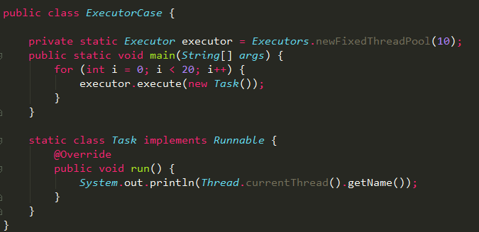
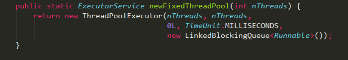
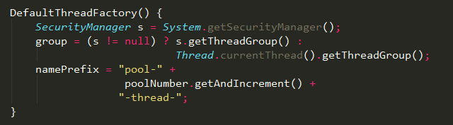

# 深入分析 JAVA 线程池的实现原理

> 2018-06-26 作者:占小狼 出处:[深入分析 JAVA 线程池的实现原理](https://www.jianshu.com/p/87bff5cc8d8c)

## 前言

线程是稀缺资源，如果被无限制的创建，不仅会消耗系统资源，还会降低系统的稳定性，合理的使用线程池对线程进行统一分配、调优和监控，有以下好处：

1.  降低资源消耗；
2.  提高响应速度；
3.  提高线程的可管理性。

Java1.5 中引入的 Executor 框架把任务的提交和执行进行解耦，只需要定义好任务，然后提交给线程池，而不用关心该任务是如何执行、被哪个线程执行，以及什么时候执行。

**demo**

1.  Executors.newFixedThreadPool(10)初始化一个包含 10 个线程的线程池 executor；
2.  通过 executor.execute 方法提交 20 个任务，每个任务打印当前的线程名；
3.  负责执行任务的线程的生命周期都由 Executor 框架进行管理；

## ThreadPoolExecutor

Executors 是 java 线程池的工厂类，通过它可以快速初始化一个符合业务需求的线程池，如 Executors.newFixedThreadPool 方法可以生成一个拥有固定线程数的线程池。

其本质是通过不同的参数初始化一个 TreadPoolExecutor 对象，具体参数描述如下：

- corePoolSize

  线程池中的核心线程数，当提交一个任务时，线程池创建一个新线程执行任务，直到当前线程数等于 corePoolSize；如果当前线程数为 corePoolSize，继续提交的任务被保存到阻塞队列中，等待被执行；如果执行了线程池的 prestartAllCoreThreads()方法，线程池会提前创建并启动所有核心线程。

* maximumPoolSize

  线程池中允许的最大线程数。如果当前阻塞队列满了，且继续提交任务，则创建新的线程执行任务，前提是当前线程数小于 maximumPoolSize；

* keepAlive Time

  线程空闲时的存活时间，即当线程没有任务执行时，继续存活的时间；默认情况下，该参数只在线程数大于 corePoolSize 时才有用；

* unit

  keepAliveTime 的单位;

* workQueue

  用来保存等待被执行的任务的阻塞队列，且任务必须实现 Runable 接口，在 JDK 中提供了如下阻塞队列：

  1.  **ArrayBlockingQueue：** 基于数组结构的有界阻塞队列，按 FIFO 排序任务；
  2.  **LinkedBlockingQuene：** 基于链表结构的阻塞队列，按 FIFO 排序任务，吞吐量通常要高于 ArrayBlockingQuene;
  3.  **SynchronousQuene：** 一个不存储元素的阻塞队列，每个插入操作必须等到另一个线程调用移除操作，否则插入操作一直处于阻塞状态，吞吐量通常要高于 LinkedBlockingQuene；
  4.  **PriorityBlockingQuene：** 具有优先级的无界阻塞队列；

* threadFactory

  创建线程的工厂，通过自定义的线程工厂可以给每个新建的线程设置一个具有识别度的线程名。

  

* handler
