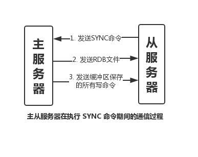

# Redis主从同步(复制)

> 今天在头条中看到一篇关于Redis主从同步的文章，把它记录下来。

作者：七淅 公众号：不只java  日期：2019-02-23

当有多天 Redis 服务器时，肯定就有一台主服务器和多台从服务器。一般来说，主服务器进行写操作，从服务器进行读操作。那么，从服务器如何和主服务器进行数据同步的呢？

## 一、如何进行主从同步

假如，现在有2台 Redis 服务器，地址分别是：127.0.0.1:6379 和 127.0.0.1:12345，我们在 127.0.0.1:12345 的客户端输入命令：

```shell
127.0.0.1:12345> SLAVEOF 127.0.0.1:6379
```

如此 127.0.0.1:12345 服务器就会去复制 127.0.0.1:6379 的数据。即前者是从服务器，后者为主服务器。除了以上方式进行复制之外，还可以通过配置文件中读 `slaveof` 选项进行设置。Redis 是怎么进行主从同步的呢？

## 二、主从同步的实现过程

主从同步分为2个步骤：同步和命令传播

+ 同步：将从服务器的数据库状态更新成主服务器当前的数据库状态。
+ 命令传播：当主服务器数据库状态被修改后，导致主从服务器数据库状态不一致，此时需要让主从数据同步到一致的过程。

上面就是主从同步2个步骤的作用，下面细说两个步骤的实现过程。

这里需要提前说明一下：在 Redis 2.8 版本之前，进行主从复制时一定会顺序执行上述两个步骤，而从 2.8 开始则可能只需要执行命令传播即可。在下文也会解析为什么会这样。

1. 同步

从服务器对主服务器的同步操作，需要通过 `sync` 命令来实现，以下是 `sync` 命令的执行步骤：

a. 从服务器向主服务器发送 `sync` 命令；

b. 收到 `sync` 命令后，主服务器执行 `bgsave` 命令，用来生成 rdb 文件，并在一个缓冲区中记录从现在开始执行的写命令；

c. `bgsave` 执行完成后，将生成的 rdb 文件发送给从服务器，用来给从服务器更新数据；

d. 主服务器再将缓冲区记录的写命令发送给从服务器，从服务器执行完这些写命令后，此时的数据库状态便和主服务器一致了。

用图表示就是这样的：



2. 命令传播

经过同步操作，此时主从数据库状态其实已经一致了，但这种一致的状态并不是一成不变的。

在完成同步之后，也许主服务器马上就接受到了新的写命令，执行完该命令后，主从的数据库状态又不一致了。

为了再次让主从数据库状态一致，主服务器就需要向从服务器执行命令传播操作，即把刚才造成不一致的写命令，发送给从服务器去执行，从服务器执行完成之后，主从数据库状态就又恢复一致了。

疑问：当发生上述不一致的情况后，Redis 再执行同步操作不就OK了吗？

从效果上来说，的确是可以恢复同步，但其实没有必要。原因是实现同步但 `sync` 命令是一个非常消耗资源但操作，看完下面的说明相信你肯定理解的。

> `SYNC` 命令是一个非常消耗资源的操作
>
> 每次执行 `SYNC` 命令，主从服务器需要执行以下动作：
>
> 1. 主服务器需要执行 `BGSAVE` 命令来生成 RDB 文件，这个生成操作会耗费主服务器大量的 CPU、内存和磁盘 I/O 资源。
>
> 2. 主服务器需要将自己生成的 RDB 文件发送给从服务器，这个发送操作会耗费主从服务器大量的网络资源（带宽和流量），并对主服务器响应命令请求的时间产生影响。
>
> 3. 接收到 RDB 文件的从服务器需要载入主服务器发送来的 RDB 文件，并且在载入期间，从服务器会因为阻塞二没办法处理命令请求。
>
> 因为 `SYNC` 命令是一个如此耗费资源的操作，所以 Redis 有必要保证在真正有需要时才执行 `SYNC` 命令。

既然同步是一个非常消耗资源的操作，那 Redis 有没有什么优化方法呢？答案当然是有的。

3. 优化版同步操作

2.8 版本开始，进行主从同步可能只需要执行命令传播即可。这个也是因为 `sync` 比较耗资源，从而采取的优化。

先看下前提条件：

> 主从同步实际分2种情况：
>
> + 初次复制：从服务器第一次复制当前主服务器（PS: 主服务器是有可能更换的）
>
> + 断线后重复制：处于命令传播阶段的主从服务器，因为网络问题而中断复制，从服务器通过自动重连，重新连接上主服务器并继续复制。

在断线后重复制的情况下，在 2.8 版本之前，会再次执行同步（`sync` 命令）和命令传播。

如果说，在断线期间，主服务器（已有上万键值对）只执行了几个写命令，为了让从服务器弥补这几个命令，却要重新执行 `sync` 来生存新的 RDB 文件，这也是非常低效的。

`psync` 具有完整重同步和部分重同步两种模式：

+ 完整重同步：用于初次复制情况，执行过程同 `sync`；

+ 部分重同步：用于断线后重复制情况，如果满足一定条件，主服务器只需要将断线期间执行的写命令发送给从服务器即可。

因此很明显，当主从同步出现断线后重复制的情况，`psync` 的部分重同步模式可以解决 `sync` 的低效情况。

上面的介绍中，出现了「满足一定条件」，那又是什么条件呢？其实就是一个偏移量的比较，具体可以继续往下看。

4. 部分重复同步的实现

部分重同步共功能由以下3部分组成：

+ 主从服务器的复制偏移量

+ 主服务器的复制积压缓冲区

+ 服务器的运行ID (run id)

a. 复制偏移量

执行复制的主从服务器都会分别维护各自的复制偏移量：

+ 主服务器每次向从服务器传播 n 个字节的数据时，都会将自己的复制偏移量加 n。

+ 从服务器接受主服务器传来的数据时，也会将自己的复制偏移量加 n

举个例子：

若当前主服务器的复制偏移量为 10000，此时向从服务器传播 30 个字节数据，结束后复制偏移量为 10030。

这时，从服务器还没接收这30个字节数据就断线了，然后重新连接上之后，该从服务器的复制偏移量依旧为 10000，说明主从数据不一致，此时会向主服务器发送 `psync` 命令。那么主服务器应该对从服务器执行完整重同步还是部分重同步呢？如果执行部分重同步的话，主服务器又如何知道同步哪些数据给从服务器呢？

以下答案都和复制积压缓冲区有关

b. 复制积压缓冲区

首先，复制积压缓冲区是一个固定长度，先进先出的队列，默认 1MB。

当主服务器进行命令传播时，不仅会将命令发送给从服务器，还会发送给这个缓冲区。

因此复制积压缓冲区的构造是这样的：


当从服务器向主服务器发送 `psync` 命令时，还需要将自己的复制偏移量带上，主服务器就可以通过这个复制偏移量和复制积压缓冲区的偏移量进行对比。

若复制积压缓冲区存在从服务器的复制偏移量 +1 后的数据，则进行部分重同步，否则进行完整重同步。

c. run id

运行 id 是在进行初次复制时，主服务器将会将自己的运行 id 发送给从服务器，让其保存起来。

当从服务器断线重连后，从服务器会将这个 `run id` 发送给刚连接上的主服务器。

若当前服务器的 `run id` 与之相同，说明从服务器断线前复制的服务器就是当前服务器，主服务器可以尝试执行部分同步；

若不同，则说明从服务器断线前复制的服务器不是当前服务器，主服务器直接执行完整重同步。

5. 心跳检测

刚才提到，主从同步有同步和命令传播2个步骤。

当完成了同步之后，主从服务器就会进入命令传播阶段，此时从服务器会以每秒1次的频率，向主服务器发送命令：`RELICONF ACK <replication_offset>`，其中 `replication_offset` 是从服务器当前的复制偏移量

发送这个命令主要有三个作用：

+ 检测主从服务器的网络状态

+ 辅助实现 `min-slaves` 选项

+ 检测命令丢失（若丢失，主服务器会将丢失的写命令重新发送给从服务器）

## 三、总结

+ 发送 `SLAVEOF` 命令可以进行主从同步，比如：SLAVEOF 127.0.0.1:6379

+ 主从同步有同步和命令传播2个步骤。

+ 同步：将从服务器的数据库状态更新成主服务器当前的数据库状态（一个消耗资源的操作）

+ 命令传播：当主服务器数据库状态被修改后，导致主从服务器数据库状态不一致，此时需要让主从数据同步到一致的过程

+ 主从同步分初次复制和断线后复制两种情况

+ 从 2.8 版本开始，在出现断线后重复制情况时，主服务器会根据复制偏移量、复制积压缓冲区和 `run id`，来确定执行完整重同步还是部分重同步

+ 2.8 版本使用 `psync` 命令来替代 `sync` 命令去执行同步操作。目的是为了解决同步（`sync` 命令）的低效操作。

